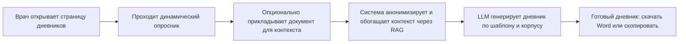

# 00. Краткое резюме проекта (Executive Summary)

> Документ для защиты диплома. Написан простым языком. Цель — за 5 минут объяснить любому члену комиссии: какую проблему мы решаем, как, какую ценность это даёт и при чём здесь Golang.

---

## 1. Рабочее название

**ПсихоДневник** (внутреннее кодовое имя — `psynote`) — система автоматической генерации медицинской документации для детского врача-психиатра стационара.

## 2. Проблема (бизнес-боль)

Детский врач-психиатр в стационаре ведёт **20–30 пациентов одновременно**. На каждого пациента он обязан:

- **каждый день** заполнять дневник наблюдения (психический статус, соматика, поведение, сон, аппетит, переносимость терапии);
- **каждые ~10 дней** оформлять расширенный «Осмотр лечащим врачом совместно с заведующим отделением» (с диагнозом, обоснованием, назначениями, этапным эпикризом).

Это **десятки страниц рукописной/печатной рутины ежедневно**. Формулировки в значительной степени шаблонны и повторяемы, но требуют юридически корректного, грамотного и индивидуализированного текста. В результате у врача почти не остаётся времени на главное — **живое общение с маленькими пациентами и их родителями**.

## 3. Решение

Веб-приложение, в котором врач **не пишет текст вручную и не ведёт свободный чат**, а проходит короткий **динамический опросник** (≈5–10 вопросов с выпадающими списками и возможностью ввести свой вариант). На основе ответов система генерирует **готовый, грамотный, юридически корректный дневник** — в стиле и терминологии, принятых в реальной практике отделения.

Качество и «узнаваемость» формулировок обеспечивается **RAG-системой** (см. ниже): модель опирается не на «общие знания из интернета», а на **корпус реальных обезличенных дневников и шаблонов** этого отделения.

Результат можно **скачать в Word** или **скопировать текстом**.

## 4. Ценность

| Что измеряем | Сейчас | Цель с продуктом |
|---|---|---|
| Время на один ежедневный дневник | 5–10 минут ручного труда | < 1 минуты (ответы на опросник) |
| Время на расширенный осмотр (10 дней) | 20–40 минут | 3–5 минут |
| Когнитивная нагрузка / «выгорание от писанины» | высокая | резко снижается |
| Время на общение с пациентом и родителями | остаточное | высвобождается |

Главная ценность — **возврат врачу времени и сил для клинической работы**, а не для бумаготворчества.

## 5. Ключевые технические решения (кратко, с обоснованием в отдельных документах)

| Решение | Выбор | Почему |
|---|---|---|
| **Роль Golang** | **API-Gateway + сервис анонимизации + сервис экспорта документов (Word)** | Go объективно силён в конкурентных сетевых сервисах, строгой типизации и потоковой обработке. Анонимизация — критичный по надёжности и скорости компонент, который должен стоять «на воротах» перед записью в БД. Это честная, защищаемая роль, а не «галочка». Вердикт по MCP — см. п. 6. |
| **RAG + векторная БД** | **Qdrant** (open-source) | Лучшая открытая специализированная векторная СУБД: быстрая, с продвинутой фильтрацией по метаданным, простой запуск в Docker. |
| **Модель эмбеддингов** | **локальная multilingual-e5-large (или ru-совместимая)**, запускается в контейнере | Медицинские данные **не должны покидать машину**. Эмбеддинги считаем локально, в облако уходит только обезличенный текст для финальной генерации. |
| **LLM** | **DeepSeek через OpenAI-совместимый API**: основная модель `deepseek-v4-flash`, fallback на `deepseek-v4-pro`/`deepseek-v4-flash` | Паттерн подключения подтверждён по референс-проекту `hh_analyser`: base URL, Bearer-ключ, ретраи и абстрактный клиент. Автоматический fallback при сбое основной модели. |
| **Анонимизация** | **Многоуровневый пайплайн (регэкспы + словари + NER для русского + валидация-гейт)** | На вход идут реальные ПДн детей; ни одно ФИО/дата/адрес/№ истории не должно попасть в БД или утечь. Анонимизация — обязательный барьер ПЕРЕД записью. |
| **Аутентификация** | **Готовое open-source решение или своя реализация на Go (JWT + Argon2id)** — рекомендация в [`09_security_privacy.md`](09_security_privacy.md) | У каждого врача свой аккаунт, каждый видит только свою историю. |
| **Реляционная БД** | **PostgreSQL** | Золотой стандарт, надёжно, бесплатно, отлично работает в Docker. |
| **Фронтенд** | **React 19 + Vite + TypeScript**, дизайн в тёмной теме в стиле cursor.com | Современно, «летает», дорогой минимализм. |
| **Деплой** | **Docker Compose** (всё локально) | Один `docker compose up` поднимает фронт, гейтвей на Go, RAG-сервис на Python, PostgreSQL, Qdrant. |

## 6. Вердикт по MCP-серверу (важно для защиты)

**MCP (Model Context Protocol)** — это открытый протокол (от Anthropic), который стандартизирует то, как приложение/модель получает доступ к «инструментам» и «источникам данных». Проще говоря — это «USB-разъём для ИИ-инструментов».

Преподаватель предложил сделать на Go именно MCP-сервер. **Наш обоснованный вердикт: для MVP это избыточно и подменяет реальную инженерную ценность ритуалом.** MCP полезен, когда нужно дать *внешнему ИИ-агенту* (например, Claude Desktop) доступ к вашим инструментам. В нашем продукте поток управляется самим приложением, а не внешним агентом, поэтому MCP не нужен на критическом пути.

**Поэтому Go получает более честную и сильную роль:** API-Gateway + сервис анонимизации + сервис экспорта. Это даёт богатый материал для дипломной защиты (конкурентность, безопасность, потоковая генерация документов). При этом мы **оставляем «опциональный MCP-фасад» как последний шаг роадмапа** — чтобы при желании показать преподавателю и MCP тоже, обернув уже готовый Go-сервис анонимизации в MCP-инструмент. Подробное обоснование — в [`02_system_architecture.md`](02_system_architecture.md).

## 7. Границы MVP

**Делаем сейчас:** **страницу генерации дневников** (ежедневный + раз в 10 дней, один день и **пакет за период**), с опросником, анонимизацией, RAG, генерацией, экспортом, аутентификацией и историей запросов.

**Закладываем в архитектуру, но НЕ делаем сейчас:** первичный осмотр, анамнез, выписной эпикриз (каждый — отдельный «роут»/страница), админку загрузки документов в корпус, клинические рекомендации как отдельный источник.

## 8. При чём здесь Golang (одно предложение для комиссии)

> «Go — это защитный периметр и рабочая лошадка системы: он принимает все запросы, **гарантированно обезличивает персональные данные ребёнка до того, как они куда-либо попадут**, оркеструет RAG и LLM, и собирает готовый документ в Word — то есть отвечает за то, что в медицинском продукте критичнее всего: безопасность данных, скорость и надёжность.»

---

Навигация по полному комплекту документов — в [`README.md`](README.md).
