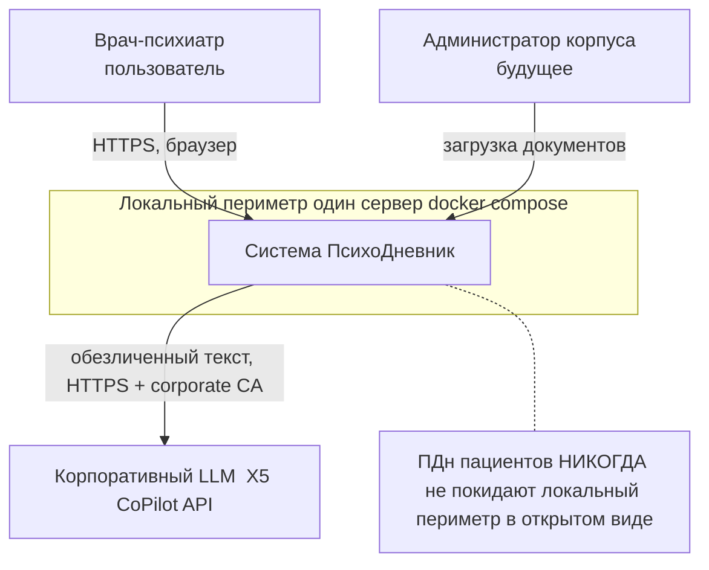
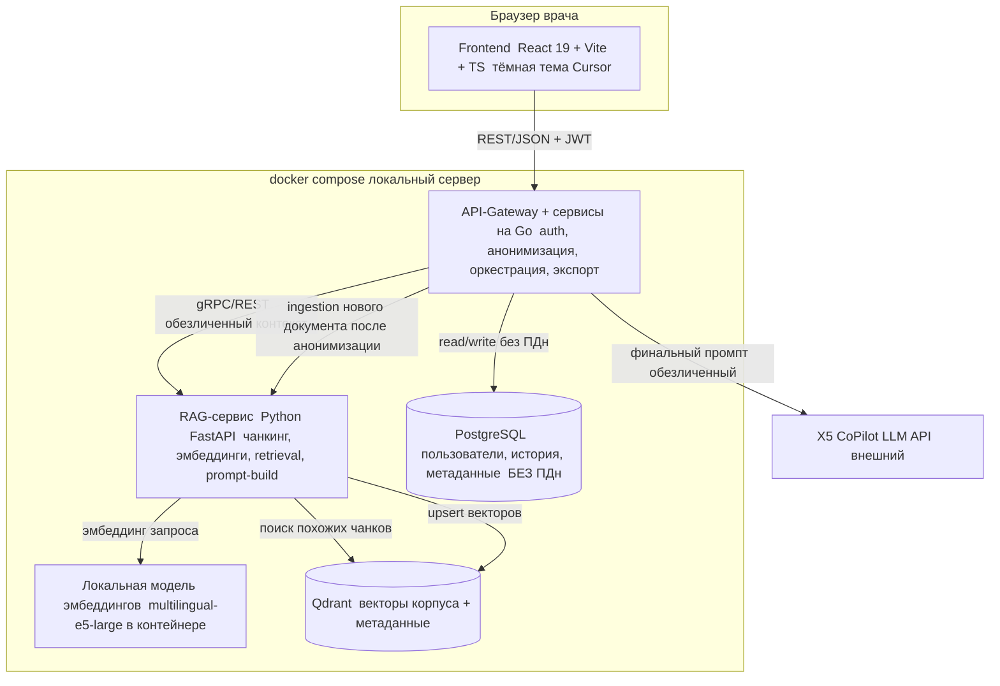
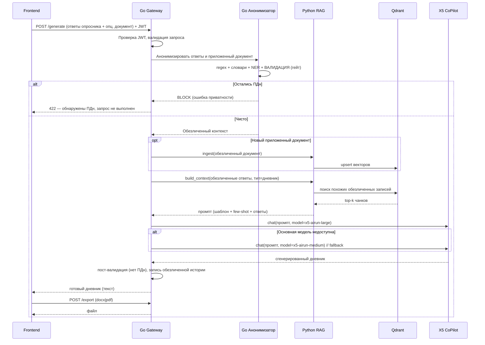
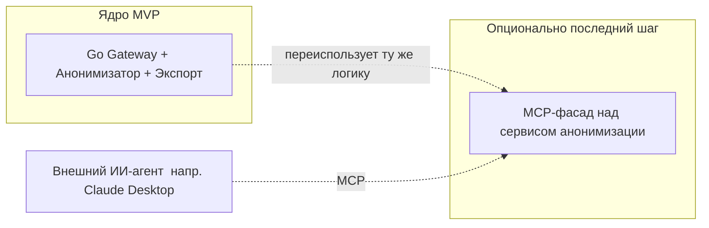
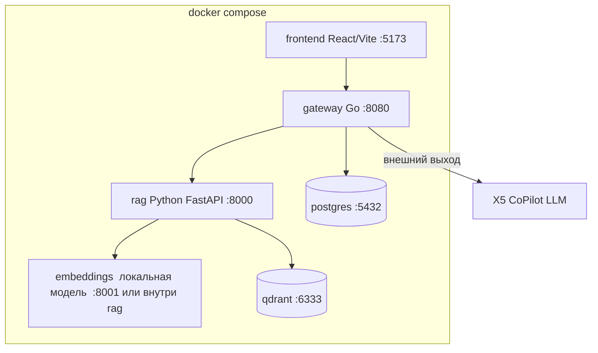

# 02. Системная архитектура (System Architecture)

> Описание архитектуры в стиле модели **C4** (Context → Containers → Components), с обоснованием выбора каждого компонента и явным ответом на вопрос «почему именно Golang и в какой роли». Диаграммы — в Mermaid.

---

## 0. Глоссарий для заказчика (простыми словами)

| Термин | Простое объяснение |
|---|---|
| **API-Gateway** | «Входная дверь» системы. Все запросы фронтенда приходят сюда. Дверь проверяет, кто пришёл (аутентификация), и направляет запрос дальше. |
| **RAG** | «Генерация с подсказкой из своей базы знаний». Перед тем как попросить ИИ написать дневник, мы находим в корпусе похожие реальные записи и подкладываем их ИИ как образец. Подробно — [`03_rag_design.md`](03_rag_design.md). |
| **Эмбеддинг** | Превращение текста в набор чисел (вектор), по которому можно искать «похожее по смыслу». |
| **Векторная БД** | Специальная база, которая хранит эти векторы и умеет быстро находить похожие. У нас — Qdrant. |
| **LLM** | Большая языковая модель (ИИ), которая и пишет текст дневника. У нас — корпоративная X5 CoPilot. |
| **MCP** | Стандартный «разъём», позволяющий внешнему ИИ-агенту пользоваться вашими инструментами. См. §6 — почему мы его не ставим в ядро. |
| **Анонимизация** | Удаление/замена персональных данных (ФИО, даты, адреса и т.д.) так, чтобы по тексту нельзя было опознать ребёнка. |

---

## 1. Контекст (C4 Level 1 — System Context)

**Ключевая идея периметра:** всё, кроме обращения к LLM, происходит локально. В облако (LLM) уходит **только уже обезличенный** текст.

---

## 2. Контейнеры (C4 Level 2 — Containers)

### 2.1. Состав контейнеров и зоны ответственности

| Контейнер | Технология | Ответственность |
|---|---|---|
| **Frontend** | React 19, Vite, TypeScript, Tailwind | Опросник, рабочая область, история, экспорт-кнопки, дизайн в стиле Cursor. |
| **API-Gateway + Go-сервисы** | **Go** (net/http или chi/fiber, gRPC опц.) | Аутентификация (JWT), маршрутизация, **анонимизация (гейт)**, оркестрация RAG↔LLM, **fallback между моделями**, сборка Word/PDF, запись обезличенной истории. |
| **RAG-сервис** | **Python** (FastAPI) | Чанкинг медицинских документов, вызов локальных эмбеддингов, retrieval из Qdrant, построение промпта (шаблон + few-shot), ingestion корпуса. |
| **Модель эмбеддингов** | Локальная (e5/ru), в контейнере | Превращение текста в векторы локально (приватность). |
| **PostgreSQL** | Postgres 16 | Врачи, сессии, история запросов, метаданные сгенерированных документов — **без ПДн**. |
| **Qdrant** | Qdrant | Векторы чанков корпуса + метаданные (тип документа, синдром, и т.п.). |

---

## 3. Поток генерации дневника (Sequence)

---

## 4. ⭐ Почему именно Golang и в какой роли (раздел для защиты)

### 4.1. Контекст требования
По условию диплома (курс Golang) Go **обязан** играть значимую роль. Важно не «прицепить Go ради галочки», а дать ему задачу, где он **объективно лучший выбор** и которую легко защитить.

### 4.2. Выбранная роль Go: **API-Gateway + Сервис анонимизации + Сервис экспорта документов**

**Почему это правильная роль именно для Go:**

1. **Анонимизация — критический по надёжности и скорости барьер.** Это «ворота», через которые проходит каждый байт пользовательских данных перед записью/отправкой. Go даёт:
   - строгую статическую типизацию и предсказуемость (меньше шансов на ошибку в коде, отвечающем за приватность);
   - высокую производительность потоковой обработки текста (regex, сканеры, пайплайны);
   - простую и безопасную конкурентность (goroutines) — можно параллельно прогонять несколько уровней детекторов.
2. **API-Gateway/оркестратор — классическая ниша Go.** Конкурентные сетевые сервисы, тайм-ауты, ретраи, fallback между моделями, агрегация ответов от RAG и LLM — Go создан для этого (вспомним, что на Go написаны Docker, Kubernetes, Traefik).
3. **Экспорт в Word/PDF** — CPU-bound потоковая генерация файлов; Go отлично держит нагрузку и легко стримит результат.
4. **Безопасность по умолчанию.** Один статически слинкованный бинарь, маленький контейнер, малая поверхность атаки — это «золотой стандарт» для компонента-привратника, отвечающего за ПДн.

**Что Go НЕ делает (и почему это правильно):** тяжёлый ML (эмбеддинги, чанкинг, retrieval-эвристики) отдаём Python — там зрелая экосистема (sentence-transformers, и т.д.). Это честное разделение труда, а не «всё на Go любой ценой».

### 4.3. Тезис для комиссии
> «Golang в проекте отвечает за то, что в медицинском продукте критичнее всего — **безопасность персональных данных, скорость и надёжность**. Он стоит на воротах: обезличивает данные ребёнка до того, как они куда-либо попадут, оркеструет ИИ-пайплайн с автоматическим резервированием модели и собирает готовый документ. Python используется там, где он силён — в ML-части RAG. Это инженерно честное распределение ролей.»

---

## 5. Обоснование выбора стека по компонентам

| Компонент | Выбор | Альтернативы (и почему не они) |
|---|---|---|
| Frontend | **React 19 + Vite + TS + Tailwind** | Vue/Svelte (отлично, но React 19 — явное требование и крупнейшая экосистема UI-компонентов). |
| Go web-фреймворк | **chi** (или стандартный `net/http`) | Gin/Fiber (тоже хороши; chi — минималистичен, идиоматичен, на стандартной библиотеке). |
| RAG-сервис | **Python + FastAPI** | Go для ML (экосистема незрелая); LangChain «из коробки» (избыточен — соберём тонко и прозрачно). |
| Векторная БД | **Qdrant** | pgvector (проще, но Qdrant быстрее и с лучшей фильтрацией); Chroma (отлично для прототипа, слабее в проде). Подробно — [`03_rag_design.md`](03_rag_design.md). |
| Реляционная БД | **PostgreSQL 16** | MySQL/SQLite (Postgres — золотой стандарт, JSONB, надёжность). |
| Эмбеддинги | **локальная multilingual-e5-large** | OpenAI/облачные эмбеддинги (НЕЛЬЗЯ — данные не должны утекать). |
| LLM | **X5 CoPilot (large → medium → small fallback)** | другие облачные LLM (нет корпоративного доступа; способ подключения уже известен из `hh_analyser`). |
| Аутентификация | **Go: JWT + Argon2id** (рекоменд.) | Keycloak/Authentik (мощно, но тяжело для 1 недели и роли «учебный Go»). См. [`09_security_privacy.md`](09_security_privacy.md). |
| Экспорт документов | **Go-библиотеки docx + PDF** | генерация на фронте (хуже контроль над форматом и стилем). |
| Деплой | **Docker Compose** | k8s (избыточно для локального MVP). |

### Как это связано с референс-проектом `hh_analyser`
Из `hh_analyser` мы **переиспользуем проверенный паттерн подключения к LLM** (см. [`03_rag_design.md`](03_rag_design.md) §LLM): OpenAI-совместимый клиент, `base_url`, Bearer-ключ, **корпоративный CA-bundle** (`LLM_CA_BUNDLE`), абстрактный интерфейс клиента, ретраи. В `hh_analyser` это реализовано на Python; у нас аналогичную логику с fallback реализует Go-Gateway (а при необходимости — RAG-сервис на Python, копируя готовый паттерн).

---

## 6. ⭐ Что такое MCP и наш вердикт (раздел для защиты)

### 6.1. Что такое MCP (простыми словами)
**MCP (Model Context Protocol)** — открытый протокол (Anthropic, 2024), стандартизирующий, как ИИ-приложение/агент получает доступ к **инструментам** (функциям, которые можно вызвать) и **ресурсам** (источникам данных). Аналогия: **«USB-C для ИИ-инструментов»** — один стандартный разъём вместо кучи самописных интеграций. MCP-сервер «публикует» инструменты; MCP-клиент (например, Claude Desktop, IDE-агент) их вызывает.

### 6.2. Зачем его предлагают
Преподаватель предложил роль Go = MCP-сервер. Это разумно как учебная тема: MCP-серверы часто пишут на Go.

### 6.3. Почему для ядра MVP это НЕ оптимально
- В нашем продукте **поток управляется самим приложением** (фронт → Go → RAG → LLM), а не **внешним ИИ-агентом**. MCP же нужен именно для того, чтобы *сторонний агент* мог дёргать ваши инструменты. У нас такого потребителя нет.
- Поставить MCP на критический путь генерации = добавить лишний слой протокола без бизнес-ценности и съесть дефицитное время недели.
- Ценность Go гораздо выше и понятнее на защите в роли **привратника данных + оркестратора**, чем в роли тонкого MCP-адаптера.

### 6.4. Решение (вердикт)
1. **Ядро:** Go = **API-Gateway + анонимизация + экспорт** (см. §4). Это основная, защищаемая роль.
2. **Опциональный бонус (последний шаг роадмапа):** обернуть уже готовый **Go-сервис анонимизации** в **MCP-сервер** — то есть опубликовать инструмент `anonymize_text` по протоколу MCP. Тогда на защите можно показать и MCP «как вишенку», но без риска для ядра.

Это даёт «и то, и другое»: реальную инженерную ценность Go **и** возможность продемонстрировать MCP.

---

## 7. Топология docker-compose

**Сервисы compose:** `frontend`, `gateway` (Go), `rag` (Python), `embeddings` (может быть частью `rag`), `postgres`, `qdrant`. Плюс one-shot контейнеры миграций и первичного ingestion корпуса. Секреты и CA-bundle монтируются через `.env` и volume (как в `hh_analyser`: `LLM_CA_BUNDLE=/app/certs/...`).

---

## 8. Архитектурные решения (ADR-кратко)

| ID | Решение | Обоснование |
|---|---|---|
| AD-1 | Go = Gateway + Анонимизация + Экспорт | Лучшая ниша Go; критичность приватности; защищаемость на дипломе. |
| AD-2 | RAG на Python | Зрелая ML-экосистема. |
| AD-3 | Qdrant как векторная БД | Скорость + фильтрация по метаданным + простой Docker-запуск. |
| AD-4 | Локальные эмбеддинги | Приватность: данные не уходят в облако. |
| AD-5 | LLM с fallback large→medium→small | Надёжность генерации. |
| AD-6 | Анонимизация-гейт ПЕРЕД любой записью | Жёсткое требование приватности. |
| AD-7 | MCP — опционально, как фасад над Go-анонимизатором | Ценность Go выше в роли привратника; MCP — бонус. |
| AD-8 | Каждый тип документа = отдельный роут + конфиг опросника + промпт | Масштабируемость без переписывания ядра. |

---

Дальше: дизайн RAG и LLM — [`03_rag_design.md`](03_rag_design.md).
