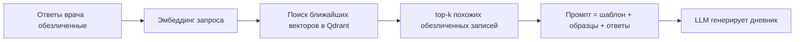
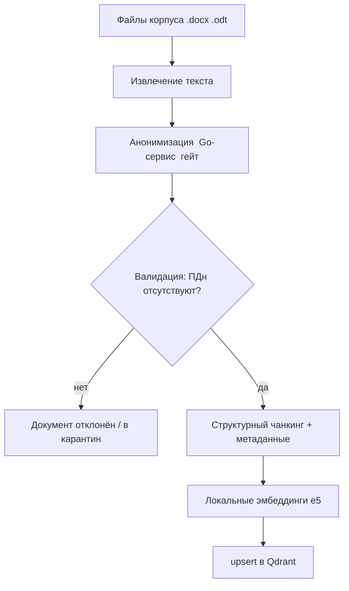
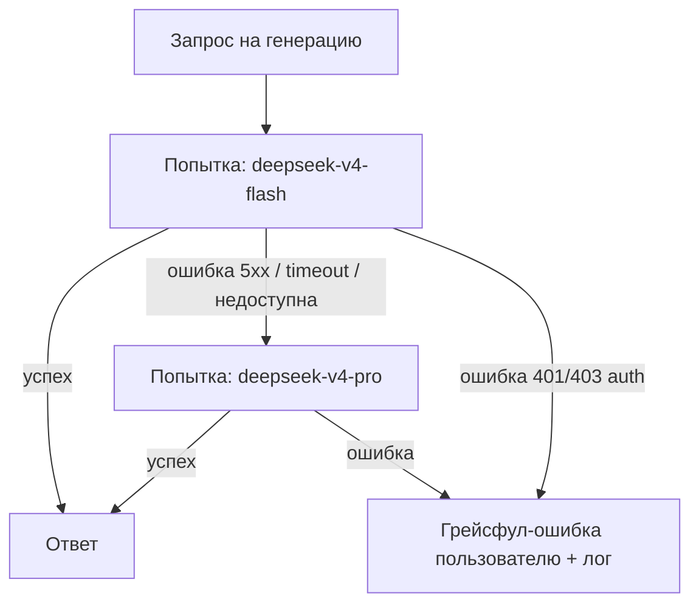

# 03. Дизайн RAG и LLM (Retrieval-Augmented Generation)

> Сначала — объяснение «на пальцах» для заказчика, затем — инженерный дизайн: векторная БД, эмбеддинги, чанкинг, ingestion, retrieval, промпт-инжиниринг, подключение LLM (по референс-проекту `hh_analyser`), fallback, и решение по клиническим рекомендациям.

---

## 1. Что такое RAG простыми словами

Представьте, что вы просите умного, но «незнакомого с вашим отделением» ассистента написать дневник. Он напишет грамотно, но «не по-вашему». **RAG** решает это так:

1. У нас есть **корпус** — много реальных (обезличенных) дневников именно вашего отделения.
2. Когда врач отвечает на опросник, мы **находим в корпусе самые похожие записи** (по смыслу, а не по словам).
3. Эти найденные записи мы **подкладываем ИИ как образец** вместе с заданием: «напиши новый дневник в таком же стиле, с такими ответами».
4. ИИ генерирует текст, **опираясь на ваши же формулировки**.

**RAG = «Retrieval (найти похожее) + Augmented (обогатить запрос) + Generation (сгенерировать)».** Это даёт узнаваемый, «родной» стиль и снижает выдумки модели.

### Что такое эмбеддинг и векторная БД (на пальцах)
- **Эмбеддинг** — это превращение фразы в список чисел (вектор), так что у похожих по смыслу фраз — близкие числа. «Настроение снижено» и «фон настроения гипотимный» окажутся рядом, хотя слова разные.
- **Векторная БД** (Qdrant) хранит эти векторы и за миллисекунды находит «ближайшие» — то есть самые похожие по смыслу куски корпуса.



---

## 2. Выбор векторной БД: **Qdrant**

| Критерий | Qdrant | pgvector | Chroma |
|---|---|---|---|
| Open-source / бесплатно | ✅ | ✅ | ✅ |
| Скорость на средних корпусах | ✅ высокая | средняя | средняя |
| Фильтрация по метаданным (тип документа, синдром) | ✅ мощная | базовая | базовая |
| Запуск в Docker | ✅ один образ | ✅ (расширение Postgres) | ✅ |
| Зрелость для прод | ✅ | ✅ | прототип |

**Решение: Qdrant.** Причины: отличная фильтрация по метаданным (нам важно искать «похожие записи **того же типа документа** и желательно **того же синдрома/регистра**»), высокая скорость, простой отдельный контейнер. 

> Запасной вариант: если время поджимает, **pgvector** позволяет не поднимать отдельный сервис (вектор живёт прямо в PostgreSQL). Это допустимый «План Б» для экономии времени; в роадмапе отмечено.

---

## 3. Выбор модели эмбеддингов (русский язык + приватность)

**Жёсткое ограничение:** эмбеддинги должны считаться **локально** — нельзя отправлять медицинский текст во внешний эмбеддинг-API (даже обезличенный корпус лучше держать локально для индексации).

**Рекомендация:** локальная мультиязычная модель с сильной поддержкой русского:
- **`intfloat/multilingual-e5-large`** — проверенная мультиязычная модель, хорошо работает с русским, формат «query:/passage:» удобен для RAG. Запускается в контейнере через `sentence-transformers`.
- Альтернатива: **`ai-forever/ru-en-RoSBERTa`** / другие ru-эмбеддеры, либо `multilingual-e5-base` (быстрее, чуть менее точно).

> Важно: облачные эмбеддинг-модели доступны у разных провайдеров, но для индексации медицинского корпуса мы их **не используем** (приватность). Локальная модель — осознанный выбор ради NFR-P3.

| Критерий | Локальная e5-large | Облачная эмбеддинг-модель |
|---|---|---|
| Приватность данных | ✅ всё локально | ❌ текст уходит в облако |
| Русский язык | ✅ хорошо | ✅ хорошо |
| Стоимость | бесплатно | по тарифу API |
| **Вывод** | **выбираем** | не для медкорпуса |

---

## 4. Чанкинг медицинских документов

Дневники имеют **чёткую структуру** (выявлена при анализе корпуса). Поэтому чанкинг — **структурно-осознанный**, а не «слепое нарезание по N символов».

### Единицы корпуса
Из анализа реальных файлов (`.docx` дневников) видно два типа записей:

1. **Ежедневная запись** — обычно один абзац: дата + психический статус + (опц.) соматика/неврология + подпись. Иногда объединена на 2–3 дня (`30.11—01.12`).
2. **Расширенный осмотр (раз в 10 дней)** — структурированные секции:
   `Жалобы`, `Анамнез заболевания (дополнения)`, `Анамнез жизни (дополнения)`, `Физикальное исследование`, `Неврологический статус`, `Психический статус`, `Диагноз / Основное заболевание / Синдром / Сопутствующие`, `Назначения`, `Выполнены медицинские вмешательства`, `План обследования/лечения`, `Этапный эпикриз`.

### Стратегия чанкинга
- **Чанк = одна логическая запись/секция.** Ежедневная запись — один чанк. Расширенный осмотр — либо один чанк целиком (если влезает в контекст), либо разбивается по секциям с общими метаданными.
- **Метаданные каждого чанка** (для фильтрации в Qdrant):
  - `doc_type`: `daily` | `exam_10d`
  - `section`: `psych_status` | `somatic` | `neuro` | `epicrisis` | `full` ...
  - `syndrome` (если извлекаемо): напр. `тревожно-депрессивный`, `психопатоподобный`
  - `diagnosis_class`: верхний уровень МКБ (напр. `F9x`, `F06`) — **без идентификации пациента**
  - `dynamics`: `улучшение` | `без динамики` | `ухудшение` (если извлекаемо)
- **ВАЖНО:** в Qdrant попадает **только обезличенный** текст (ФИО врачей/пациентов, даты, адреса, № историй — удалены, см. [`04_anonymization.md`](04_anonymization.md)). Даты и подписи врачей вырезаются на этапе ingestion.

---

## 5. Пайплайн ingestion корпуса



Шаги:
1. **Извлечение текста** из `.docx`/`.odt` (docx = zip с XML; odt = zip с `content.xml`).
2. **Анонимизация** через тот же Go-сервис, что и в рантайме (единый код — единые гарантии).
3. **Валидация-гейт**: если остались ПДн — документ не индексируется (карантин + лог-счётчик).
4. **Чанкинг** + простановка метаданных.
5. **Эмбеддинги** локально.
6. **upsert** в Qdrant.

На MVP ingestion запускается **CLI/скриптом** (one-shot контейнер в compose). UI-админка — будущее.

---

## 6. Retrieval-стратегия для генерации дневника

При запросе:
1. Формируем **поисковый текст** из ответов опросника (например: «тревожно-депрессивный синдром, настроение снижено, сон нарушен, аппетит снижен, поведение упорядочено, динамика без изменений»).
2. Считаем эмбеддинг запроса локально.
3. Ищем в Qdrant top-k (например, k=4–6) **с фильтром по метаданным**:
   - тот же `doc_type` (для ежедневного — `daily`, для осмотра — `exam_10d`);
   - желательно тот же `syndrome`/`diagnosis_class` (если врач указал диагноз/синдром);
   - предпочтительно нужная `section`.
4. Возвращаем найденные обезличенные образцы как **few-shot примеры**.

> Эта фильтрация — ключевое преимущество Qdrant: мы не просто берём «похожее», а «похожее **нужного типа и регистра**».

---

## 7. Как используются шаблоны

Два шаблона (`шаблон каждый день.odt`, `шаблон раз в 10 дней.odt`) задают **обязательную структуру и разделы** итогового документа. Они используются как **жёсткий каркас** промпта (а не как материал для свободной генерации):

- Шаблон определяет, какие разделы должны быть в выводе и в каком порядке (для осмотра — Жалобы → Анамнез → Физикальное → Неврологический → Психический статус → Диагноз → Назначения → Вмешательства → Планы → Этапный эпикриз).
- RAG-образцы задают **стиль и наполнение** разделов.
- Ответы опросника задают **индивидуальное содержание**.

Шаблоны хранятся как параметризуемые структуры (см. [`06_dynamic_questionnaire.md`](06_dynamic_questionnaire.md)) и версионируются.

---

## 8. Промпт-инжиниринг

Структура промпта (логически):

```
[SYSTEM]
Ты — ассистент детского врача-психиатра. Пишешь медицинские дневники строго в стиле
и терминологии отделения. Не выдумывай факты. Используй только предоставленные данные.
Соблюдай структуру шаблона. Пиши на русском, сохраняй МКБ-коды и латинские названия
препаратов. НИКОГДА не вставляй реальные ФИО, даты рождения, адреса — используй плейсхолдеры.

[CONTEXT: ШАБЛОН]
<структура разделов нужного типа документа>

[CONTEXT: ОБРАЗЦЫ ИЗ КОРПУСА  (обезличенные, top-k)]
<пример 1>
<пример 2>
...

[USER: ОТВЕТЫ ОПРОСНИКА]
Тип: ежедневный дневник
Психический статус: ...
Настроение: снижено
Сон: нарушен (трудности засыпания)
Аппетит: снижен
Поведение: упорядочено
Динамика: без существенных изменений
...

[INSTRUCTION]
Сгенерируй готовый дневник по шаблону, в стиле образцов, на основе ответов.
```

Принципы:
- **Низкая температура** (≈0.3–0.5) — нужна предсказуемость и юридическая аккуратность, а не творчество.
- **Anti-hallucination**: явный запрет выдумывать факты, использовать только данные опросника + образцы.
- **Плейсхолдеры вместо ПДн**: дату/подпись врач подставляет при выгрузке (или система вставляет нейтральные плейсхолдеры `[ДАТА]`, `[ФИО ВРАЧА]`), чтобы в генерацию не попадали реальные ПДн.
- **Уникальность**: просим варьировать формулировки, чтобы соседние записи не были дословными копиями.

---

## 9. Подключение LLM (по паттерну `hh_analyser`)

> Изучен проект `/Users/user/Desktop/hh_analyser`. Ниже — паттерн OpenAI-совместимого подключения, который используется в нашем Go-Gateway (или, как «План Б», в Python).

### 9.1. Базовые параметры
| Параметр | Значение | Источник |
|---|---|---|
| Тип API | **OpenAI-совместимый** (DeepSeek) | `openai` SDK |
| `base_url` | `https://api.deepseek.com` | `LLM_BASE_URL` |
| Авторизация | **Bearer-ключ** (`LLM_API_KEY`) | `.env` |
| Эндпоинты | `POST /chat/completions`, `GET /models` | OpenAI-совместимый API |
| TLS / сертификаты | Стандартное публичное TLS-доверие; `LLM_CA_BUNDLE` пуст по умолчанию. Для корпоративного прокси можно указать PEM, при этом верификация TLS **остаётся включённой** | `.env` → `LLM_CA_BUNDLE` |
| Тайм-ауты/ретраи | timeout 60s, до 3 ретраев с экспоненциальным backoff; 401/403 — не ретраим, 429/5xx/timeout — ретраим | паттерн `hh_analyser` |

### 9.2. TLS и опциональный CA-bundle
Для публичного Gemini дополнительный сертификат не нужен:

- В `.env`: `LLM_CA_BUNDLE=` по умолчанию.
- При доступе через корпоративный прокси можно смонтировать PEM и задать путь в `LLM_CA_BUNDLE`.
- Клиент при наличии PEM строит TLS-контекст, доверяющий этому CA, **не отключая проверку** (`ssl.create_default_context(cafile=ca_bundle)`).
- Ключ API **никогда не логируется**.

**В нашем Go-Gateway** аналог: создать `http.Client` с `tls.Config{RootCAs: pool}`, где `pool` загружен из PEM (`x509.NewCertPool().AppendCertsFromPEM(...)`), и передать его в OpenAI-совместимый Go-клиент (`go-openai`) c `BaseURL` и `Authorization: Bearer`.

### 9.3. Доступные модели
| Модель | Назначение | Используем |
|---|---|---|
| `deepseek-v4-flash` | быстрая/дешёвая, основная генерация | ✅ **основная** |
| `deepseek-v4-pro` | более сильная резервная | ✅ **fallback** |

> Перед стартом нужно подтвердить доступность моделей ключу через `GET /models`. Если `deepseek-v4-flash` недоступна — основной становится `deepseek-v4-pro`.

### 9.4. Абстракция и заменяемость
Повторяем принцип `hh_analyser`: **абстрактный интерфейс LLM-клиента** (методы `Chat`, при необходимости `Embeddings`) + конкретная реализация для DeepSeek. Это позволяет заменить провайдера, не трогая бизнес-логику; альтернативами могут быть OpenRouter или Groq.

---

## 10. ⭐ Fallback между моделями

Требование заказчика: использовать самую сильную модель, но **автоматически переключаться на резервную**, если основная недоступна/сломалась.



Правила (по образцу retry-логики `hh_analyser`):
- **Ретраи внутри одной модели** (429/5xx/timeout) с экспоненциальным backoff.
- **Переключение на следующую модель** при исчерпании ретраев или «модель недоступна».
- **Ошибки авторизации (401/403)** — не ретраим и не переключаем (это проблема ключа), сразу понятная ошибка.
- Список моделей и порядок fallback — в конфиге (`.env`), чтобы менять без пересборки.

---

## 11. ⭐ Решение по клиническим рекомендациям

**Вопрос:** нужны ли клинические рекомендации (стандарты диагностики/лечения) как источник контекста для генерации **дневников**?

**Анализ:**
- Дневник — это **фиксация наблюдаемого состояния и динамики** конкретного дня, а не обоснование схемы лечения по стандарту. Реальный корпус показывает: дневник описывает статус, поведение, сон, аппетит, переносимость терапии, консультации — он **не цитирует клинреки**.
- Клинреки релевантнее для **первичного осмотра, обоснования диагноза и выписного эпикриза** (будущие документы), где есть раздел «обоснование» и «план лечения по стандарту».
- Добавление клинреков в RAG для дневников **раздует контекст**, замедлит retrieval и внесёт шум (модель может тянуть «рекомендательные» формулировки в дневник, где они неуместны).

**Рекомендация (вердикт):**
> **На MVP клинические рекомендации НЕ подключаем** к генерации дневников. Это избыточно и потенциально ухудшает результат. **Закладываем их в архитектуру** как отдельный тип источника с собственной коллекцией в Qdrant (`source_type=clinical_guideline`), чтобы позже включать их **точечно** для тех типов документов (первичный осмотр, эпикриз), где они действительно нужны. Включение управляется конфигом per-document-type.

---

Дальше: пайплайн анонимизации — [`04_anonymization.md`](04_anonymization.md).
