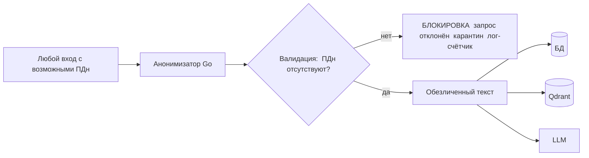
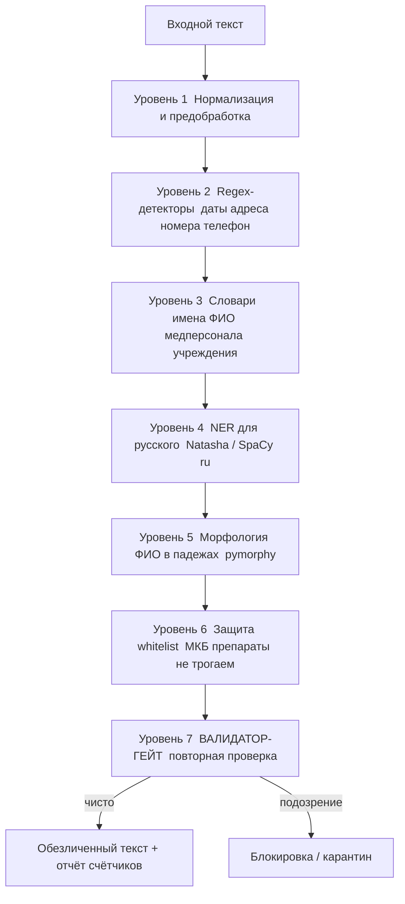

# 04. Анонимизация и валидация (критический раздел)

> Это самый ответственный компонент системы. Здесь данные ребёнка превращаются в безопасный для хранения и отправки текст. Требование жёсткое: **ни одно ФИО, дата, возраст, адрес, название больницы, ФИО медперсонала, номер истории болезни не должны попасть в БД, логи или утечь во внешний LLM.**

---

## 1. Принцип «гейта» (Gate-First)

Анонимизация — это **барьер на воротах**, а не «опция». Любые пользовательские данные (ответы опросника, приложенные документы, файлы корпуса при ingestion) проходят через анонимизатор **до**:
- записи в PostgreSQL,
- записи в Qdrant,
- отправки в LLM,
- записи в любой лог.

**Ключевое правило (NFR-P4):** если после анонимизации валидатор всё ещё находит подозрение на ПДн — система **блокирует** операцию, а не «пропускает на свой страх». Лучше отказать, чем допустить утечку.

---

## 2. Что считается PII (на основе анализа реального корпуса)

При изучении корпуса детской психиатрии выявлены следующие типы персональных/идентифицирующих данных:

| Категория | Примеры из корпуса (обобщённо, без реальных значений) | Сложность |
|---|---|---|
| **ФИО пациента** | в карточках ВК: «на имя <Фамилия Имя Отчество>», в падежах: «освидетельствования <Фамилии Имени Отчества>» | высокая (склонения) |
| **ФИО медперсонала** | подписи: «Врач-психиатр <Фамилия И.О.>», «заведующий <ФИО>», состав ВК-комиссии | средняя |
| **Даты** | даты осмотров `19.09.2025`, диапазоны `30.11—01.12`, дата рождения `ДД.ММ.ГГГГ`, «время: 10 час. 18 мин.» | средняя |
| **Возраст** | «в возрасте до пятнадцати лет», явный возраст | средняя |
| **Адреса** | «проживающий по адресу: <город, район, проспект, д., к., литера, кв.>» | высокая |
| **Названия учреждений** | «СПб ГКУЗ ЦВЛ "Детская психиатрия" им. ...», «ДГБ №19 им. ...», «ПНД №4» | средняя |
| **Номера документов** | «медицинская карта № 20252184», номер истории болезни, протокол ВК «№ 442.3» | средняя |
| **Геопривязка в имени файла/папки** | папки вида «Фамилия Имя F92.8» | средняя |

**НЕ являются PII и должны СОХРАНЯТЬСЯ** (это клиническая ценность):
- Коды МКБ-10 (`F92.8`, `F06.68`, `J00`, `R51` и т.д.).
- Латинские названия и дозировки препаратов (`Tab. Ibuprofeni 0,4`, `Хлорпротиксен 25 мг`).
- Клинические формулировки психического/соматического/неврологического статуса.
- Числовые витальные показатели (Т, АД, Ps) — сами по себе не идентифицируют.

> Тонкость: **даты осмотров** для дневника важны как структура, но являются идентифицирующими в связке. Решение: при хранении/индексации даты **заменяются плейсхолдерами/смещаются**, а в финальный документ врач подставляет реальную дату на этапе экспорта (или система вставляет `[ДАТА]`).

---

## 3. Многоуровневый пайплайн (Defense in Depth)

Один метод ненадёжен. Используем **несколько независимых уровней**, каждый ловит то, что пропустил предыдущий. Финальный уровень — валидатор-гейт.

### Уровень 1 — Нормализация
- Приведение пробелов, разрывов строк, юникод-нормализация.
- Извлечение текста из `.docx`/`.odt` без потери структуры секций.

### Уровень 2 — Regex-детекторы (быстрые, детерминированные)
Ловят структурированные ПДн (паттерн отработан в `hh_analyser/sanitizer.py`, расширяем под мед-контекст):
- **Даты** во всех форматах: `19.09.2025`, `30.11—01.12.2025`, `«06» октября 2025 г.`, `время: 10 час. 18 мин.`.
- **Телефоны** (+7/8/межд.).
- **Адреса**: маркеры `г.`, `ул.`, `пр-кт`, `пр.`, `д.`, `к.`, `кв.`, `литера`, `р-он`, `обл.`, `пос.`.
- **Номера документов**: `карта № …`, `история болезни № …`, `протокол … № …`, длинные числовые ID (напр. `20252184`).
- **Возраст**: «в возрасте … лет», «N лет».
- **СНИЛС/паспорт/полис** (на всякий случай).

### Уровень 3 — Словари (Gazetteers)
- **Словарь медперсонала отделения** (ФИО врачей, заведующих, членов ВК) — известный закрытый список → точная замена `[ФИО_ВРАЧА]`/`[ФИО_МЕДПЕРСОНАЛА]`.
- **Словарь учреждений** (названия больниц, ЦВЛ, ПНД, отделений, «им. …»).
- **Словари топонимов** (города/районы СПб и др.) для усиления адресного детектора.
- Словарь русских имён/фамилий (для подсказки NER и морфологии).

### Уровень 4 — NER для русского (статистический)
Регэкспы не ловят произвольные ФИО пациентов. Используем **NER-модель для русского**:
- **Natasha** (`natasha`/`slovnet`) — лёгкая, заточена под русский, хорошо извлекает `PER` (персоны), `LOC` (локации), `ORG` (организации). Идеально для Docker и приватности (локально).
- Альтернатива: **SpaCy `ru_core_news_lg`** или **DeepPavlov NER**.
- Извлечённые сущности `PER/LOC/ORG` → замена плейсхолдерами.

### Уровень 5 — Морфология ФИО в падежах (русская специфика)
Главная сложность русского: «Гаврилов» / «Гаврилова» / «Гаврилову» / «Гаврилова Тимофея Ивановича». 
- Используем **pymorphy2/pymorphy3** для нормализации словоформ и распознавания, что слово — фамилия/имя/отчество в косвенном падеже.
- **Отчества** распознаём по суффиксам (`-вич`, `-вна`, `-ич`, `-на`) — как в `hh_analyser`, расширяем. Найденное отчество — сильный сигнал, что соседние слова — тоже части ФИО (удаляем весь блок).

### Уровень 6 — Whitelist-защита (не навреди)
Перед заменами защищаем клинически ценное, чтобы не «съесть» его:
- Коды МКБ (`[A-Z]\d{2}(\.\d+)?`) — **никогда не трогаем**.
- Латинские названия препаратов, дозировки, единицы (мг, мл, мм рт.ст.).
- Аббревиатуры статусов (ЭКГ, ЭЭГ, УЗИ, D=S, QTc).

> Реализация: whitelist применяется как «маска неприкосновенности» — совпадения исключаются из зоны замены.

### Уровень 7 — Валидатор-гейт (финальная проверка)
После всех замен — **повторный независимый проход** более «параноидальными» детекторами:
- остаточные паттерны дат/адресов/номеров;
- остаточные кандидаты в ФИО (заглавная кириллица + морфология);
- если найдено → **блокировка** (для рантайма — ошибка пользователю «обнаружены ПДн»; для ingestion — документ в карантин + лог-счётчик).

---

## 4. Стратегия замены: плейсхолдеры с типами

Заменяем не на единый `[УДАЛЕНО]`, а на **типизированные плейсхолдеры** — это сохраняет смысл текста для генерации и для RAG:

| Сущность | Плейсхолдер |
|---|---|
| ФИО пациента | `[ПАЦИЕНТ]` |
| Пол/род (если нужен) | сохраняем грамматический род через нейтральную форму или метаданные |
| ФИО врача/медперсонала | `[ФИО_ВРАЧА]`, `[ЗАВЕДУЮЩИЙ]`, `[ЧЛЕН_ВК]` |
| Дата | `[ДАТА]`, диапазон `[ПЕРИОД]`, время `[ВРЕМЯ]` |
| Возраст | `[ВОЗРАСТ]` |
| Адрес | `[АДРЕС]` |
| Учреждение | `[УЧРЕЖДЕНИЕ]` |
| Номер документа/карты | `[НОМЕР_ДОКУМЕНТА]` |
| Родитель/представитель | `[РОДИТЕЛЬ]` |

Преимущество: модель понимает, «что здесь было», и может корректно построить фразу, но **без реальных данных**. В финальный документ врач/система подставляет актуальные значения уже на стороне клиента при экспорте.

---

## 5. Обратимость: осознанно НЕОБРАТИМАЯ анонимизация

- **В БД и Qdrant хранится только необратимо обезличенный текст.** Мы **не храним** карту соответствия «плейсхолдер → реальное значение» на сервере.
- Реальные ФИО/даты существуют только:
  - **в моменте** в оперативной памяти Go-сервиса во время обработки запроса (не персистится);
  - **на клиенте** (врач сам подставляет дату/ФИО при финальной выгрузке, либо вводит их только локально).
- Это исключает класс утечек «расшифровали из базы». Псевдонимизация с обратимым ключом сознательно **отвергнута** для MVP как лишний риск.

> Для связности внутри одного документа (чтобы `[ПАЦИЕНТ]` был один и тот же по тексту) используем **сессионные, эфемерные** соответствия, живущие только в памяти на время одного запроса и стираемые после ответа.

---

## 6. Почему анонимизатор — на Go

- **Критичность → строгая типизация и предсказуемость.** Код, отвечающий за приватность, должен быть максимально надёжным; Go это поддерживает.
- **Скорость потоковой обработки** (regex, сканеры) — Go быстр и экономичен.
- **Конкурентность** — несколько уровней детекторов можно гонять параллельно (goroutines).
- **Единый код для рантайма и ingestion** — один и тот же сервис обезличивает и пользовательский ввод, и корпус. Одни гарантии везде.

> Для NER/морфологии (Уровни 4–5), которые удобнее на Python, есть два варианта:
> 1. Go вызывает выделенный микро-сервис NER (Python) **внутри локального периметра** (данные не покидают сервер).
> 2. Go-only реализация regex+словари+морфология (есть Go-порты), а NER — как усиление.
>
> **Рекомендация:** Go отвечает за оркестрацию гейта и уровни 1–3, 6–7; NER (уровни 4–5) — локальный Python-сайдкар. Граница «гейта» остаётся в Go.

---

## 7. Тестирование качества анонимизации

Без тестов этому компоненту нельзя доверять. План:

| Тип теста | Что проверяет |
|---|---|
| **Unit-тесты детекторов** | каждый regex/словарь/правило на наборе примеров (включая падежи ФИО, диапазоны дат, адреса СПб). |
| **Golden-набор** | подготовить вручную обезличенные эталоны нескольких реальных дневников; сравнивать вывод с эталоном. |
| **Recall-тест (главный)** | синтетические тексты с «подсаженными» ПДн → измеряем долю пойманных. Цель recall ПДн → **близко к 100%**. |
| **Precision-тест (не навреди)** | проверяем, что МКБ-коды, препараты, статусы НЕ удаляются. |
| **Adversarial-тест** | ФИО в редких падежах, опечатки, латиница/кириллица-микс, ФИО без отчества, инициалы `И.О.`. |
| **Регрессия** | при изменении правил прогоняем весь набор. |
| **Метрика-гейт** | в CI: если recall ПДн ниже порога — сборка падает. |

**Логирование:** логируем **только количество** обезличенных сущностей по категориям (как в `hh_analyser`: «removed: ФИО=3, даты=5»), **никогда сами значения**.

---

## 8. Краевые случаи и риски

| Риск | Митигизация |
|---|---|
| Редкая фамилия не распознана NER | словари + морфология + валидатор-гейт; при сомнении — блок. |
| ФИО совпадает с обычным словом | контекст + морфология отчества; whitelist частых не-имён (как `_FIO_SKIP_WORDS` в `hh_analyser`). |
| Дата как часть клинического факта (напр. «QTc от 23.09») | заменяем дату на `[ДАТА]`, клиническую суть сохраняем. |
| Имя в имени файла/папки корпуса | анонимизируем и пути/имена файлов на ingestion, не только содержимое. |
| Утечка через лог | запрет логировать значения; код-ревью; статический анализ. |
| Ребёнок назван по имени внутри психического статуса | NER + морфология ловят; валидатор-гейт страхует. |

---

## 9. Итоговые гарантии (что мы обещаем на защите)

1. Любой вход проходит **обязательный гейт** до записи/отправки.
2. Применяется **минимум 5 независимых уровней** детекции + финальный валидатор.
3. При сомнении система **блокирует**, а не пропускает.
4. В БД/Qdrant — **только необратимо обезличенный** текст; карта расшифровки на сервере **не хранится**.
5. Эмбеддинги и NER — **локально**; в облако (LLM) уходит уже обезличенный текст.
6. Качество подтверждается **тестами recall/precision** с гейтом в CI.

---

Дальше: модель данных — [`05_data_model.md`](05_data_model.md).