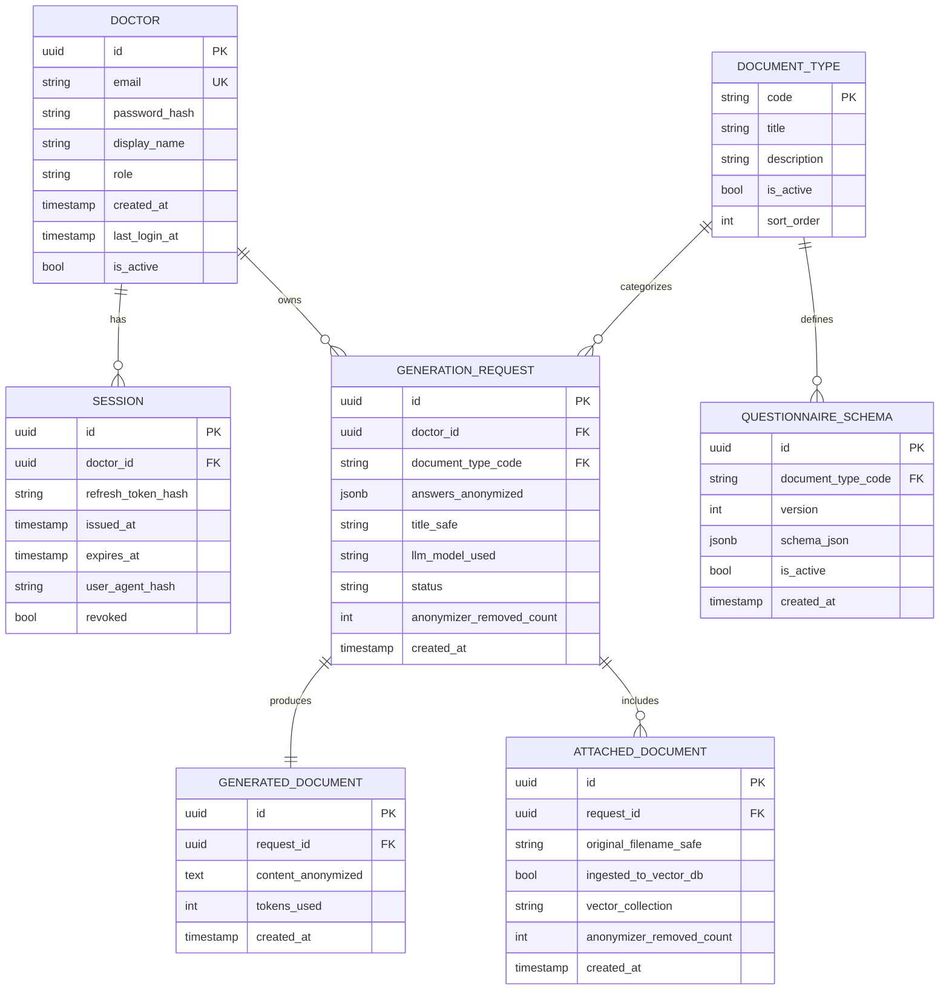

# 05. Модель данных (Data Model)

> Схема реляционной БД (PostgreSQL) и векторной БД (Qdrant). Главный принцип: **в БД нет персональных данных пациентов**. Хранятся только аккаунты врачей, обезличенная история и метаданные.

---

## 1. Принципы

1. **No-PII by design.** Ни одна таблица не содержит ФИО/дат/адресов пациентов. Тексты, привязанные к истории, хранятся уже обезличенными (после гейта из [`04_anonymization.md`](04_anonymization.md)).
2. **Изоляция по врачу.** Все пользовательские данные привязаны к `doctor_id`; запросы всегда фильтруются по владельцу.
3. **Расширяемость по типам документов.** `document_type` — справочник; добавление нового типа (первичка, эпикриз) не меняет схему.
4. **Аудит без ПДн.** Логи и метрики — только счётчики и статусы.

---

## 2. Реляционная схема (PostgreSQL)

### 2.1. ER-диаграмма



### 2.2. Описание таблиц

| Таблица | Назначение | Заметки по приватности |
|---|---|---|
| **doctor** | Аккаунты врачей. | `password_hash` — только Argon2id. `display_name` — имя врача (его собственное, не пациента; врач сам его указал, это допустимо). |
| **session** | Refresh-токены/сессии для JWT-аутентификации. | Хранится **хэш** токена, не сам токен. `user_agent_hash` — без сырых данных. |
| **document_type** | Справочник типов документов: `daily`, `exam_10d` (MVP), позже `primary_exam`, `anamnesis`, `discharge_epicrisis`. | Чисто конфиг. |
| **questionnaire_schema** | Версионируемая JSON-схема опросника per тип документа. | Конфиг; см. [`06_dynamic_questionnaire.md`](06_dynamic_questionnaire.md). |
| **generation_request** | Один запрос врача. `answers_anonymized` — ответы опросника **после анонимизации**. `title_safe` — безопасный заголовок для истории (напр. «Ежедневный дневник, тревожно-депрессивный, без динамики»). | **Только обезличенные** ответы. `anonymizer_removed_count` — счётчик для аудита. |
| **generated_document** | Результат генерации. `content_anonymized` — текст с плейсхолдерами (без реальных ПДн). | Реальные даты/ФИО врач подставляет на клиенте при экспорте. |
| **attached_document** | Метаданные приложенных файлов. Сам обезличенный текст идёт в Qdrant; здесь — только метаданные/факт ingestion. | Имя файла — тоже обезличенное (`original_filename_safe`). |

### 2.3. Почему `answers`/`content` хранятся обезличенными
Даже история запросов не должна содержать ПДн (NFR-P1). Врач при повторном открытии видит обезличенный черновик с плейсхолдерами и подставляет актуальные данные локально. Это гарантирует, что «утечка из базы» невозможна.

### 2.4. Статусы запроса (`generation_request.status`)
`pending` → `anonymizing` → `blocked_pii` (если гейт заблокировал) → `retrieving` → `generating` → `done` → `failed`.

---

## 3. Векторная схема (Qdrant)

### 3.1. Коллекции
| Коллекция | Содержимое | Когда наполняется |
|---|---|---|
| `corpus_diaries` | чанки обезличенных дневников отделения | ingestion корпуса (CLI) + дозагрузка приложенных документов |
| `clinical_guidelines` (будущее) | чанки клинических рекомендаций | отключено на MVP (см. [`03_rag_design.md`](03_rag_design.md) §11) |

### 3.2. Структура точки (point) в Qdrant
```jsonc
{
  "id": "uuid",
  "vector": [/* эмбеддинг чанка, локальная модель e5 */],
  "payload": {
    "text": "обезличенный текст чанка (с плейсхолдерами)",
    "doc_type": "daily | exam_10d",
    "section": "psych_status | somatic | neuro | epicrisis | full",
    "syndrome": "тревожно-депрессивный | психопатоподобный | ...",   // опц.
    "diagnosis_class": "F9x | F06 | F34 | ...",                       // опц., верхний уровень МКБ
    "dynamics": "улучшение | без_динамики | ухудшение",               // опц.
    "source": "corpus | user_upload",
    "ingested_at": "timestamp"
  }
}
```

> В `payload.text` — **только обезличенный** текст. Никаких ФИО, дат, адресов. Метаданные служат для фильтрованного retrieval (см. [`03_rag_design.md`](03_rag_design.md) §6).

### 3.3. Почему метаданные именно такие
Из анализа корпуса видно, что релевантность образца определяется: типом документа (ежедневный vs осмотр), синдромом/классом диагноза (тревожно-депрессивный F34 vs психопатоподобный F91) и направлением динамики. Эти поля позволяют находить «похожее **нужного регистра**».

---

## 4. Конфигурация и секреты (не в БД)

| Что | Где хранится |
|---|---|
| `LLM_API_KEY` | `.env` / секрет-хранилище, монтируется в Go-Gateway |
| `LLM_BASE_URL`, список моделей и порядок fallback | `.env` |
| `LLM_CA_BUNDLE` | пусто по умолчанию; путь к PEM только при корпоративном прокси, без отключения TLS-верификации |
| JWT-секрет | `.env` / секрет-хранилище |

---

## 5. Миграции

- Реляционные миграции — версионируемые (golang-migrate или аналог), one-shot контейнер `migrations` в compose (как в `hh_analyser`).
- Qdrant-коллекции создаются идемпотентным init-скриптом при первом ingestion.

---

Дальше: динамический опросник — [`06_dynamic_questionnaire.md`](06_dynamic_questionnaire.md).
