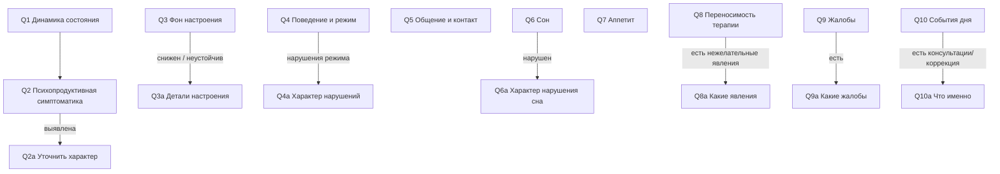
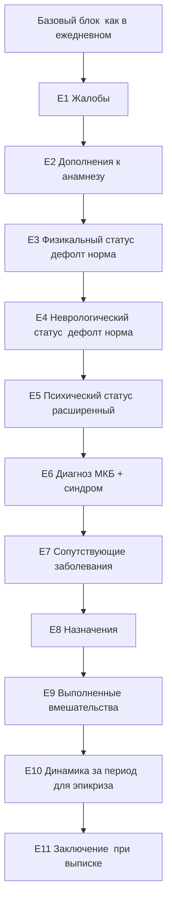

# 06. Динамический опросник (Dynamic Questionnaire)

> Спроектирован на основе анализа реальных дневников и шаблонов корпуса. Это ключевая аналитическая часть: правильные вопросы = минимум усилий врача при максимуме качества генерации.

---

## 1. Принципы дизайна опросника

1. **Не свободный чат, а структурированный опрос.** Врач отвечает быстро, преимущественно выбором из дропдаунов.
2. **5–10 базовых вопросов «в яблочко».** Базовые вопросы покрывают то, что меняется день ото дня. Постоянное (физикальный/неврологический статус в норме) подставляется по умолчанию.
3. **Условные (зависимые) вопросы.** Появляются только при определённых ответах (напр., «есть жалобы» → какие жалобы).
4. **В каждом дропдауне — опция «Свой вариант».** Врач всегда может ввести текст вручную.
5. **Дефолты по наблюдениям корпуса.** Самые частые формулировки выбраны значениями по умолчанию, чтобы ускорить ввод (в корпусе огромное число записей «без динамики», «сон/аппетит достаточны» и т.п.).
6. **Ответы → маппинг в промпт.** Каждый ответ имеет «человеческий» лейбл (для UI) и «клиническую формулировку» (для промпта).

---

## 2. Что мы извлекли из реального корпуса

Анализ дневников выявил **повторяющиеся оси описания** (это и есть основа вопросов):

**Ежедневный дневник** обычно содержит:
- общий статус сознания/ориентировки/психопродуктивной симптоматики (часто стандартная фраза);
- поведение в отделении, соблюдение режима;
- фон настроения и его устойчивость;
- характер общения (с детьми, с персоналом, с врачом);
- активность/занятость в течение дня;
- сон, аппетит;
- переносимость терапии;
- (опц.) соматическое состояние, витальные показатели;
- (опц.) консультации смежных специалистов, коррекция терапии.

**Расширенный осмотр (раз в 10 дней)** дополнительно содержит:
- жалобы; дополнения к анамнезу;
- физикальный статус, неврологический статус (часто стандартные «нормальные» блоки);
- развёрнутый психический статус;
- диагноз (МКБ-10), синдром, сопутствующие;
- назначения, выполненные вмешательства (консультации, ЭКГ/ЭЭГ/УЗИ/лаборатория);
- план обследования/лечения;
- этапный эпикриз (резюме динамики за период).

---

## 3. Формат схемы опросника (JSON)

Опросник хранится как версионируемая JSON-схема (`questionnaire_schema.schema_json`, см. [`05_data_model.md`](05_data_model.md)). Структура одного вопроса:

```jsonc
{
  "id": "mood",
  "label": "Фон настроения",
  "type": "select",                 // select | multiselect | text | number | boolean
  "required": true,
  "allow_custom": true,             // показывать опцию «Свой вариант»
  "default": "even",
  "options": [
    { "value": "even",     "label": "ровный, без снижения", "prompt": "Фон настроения ровный, без снижения." },
    { "value": "lowered",  "label": "снижен",               "prompt": "Настроение снижено." },
    { "value": "unstable", "label": "неустойчивый",         "prompt": "Фон настроения неустойчивый." }
  ],
  "conditional": [                  // какие вопросы открыть при значениях
    { "if_value": "lowered",  "show": ["mood_detail"] },
    { "if_value": "unstable", "show": ["mood_detail"] }
  ]
}
```

Движок опросника на фронте рендерит вопросы и реактивно показывает/скрывает условные вопросы. Маппинг `prompt` собирается на бэке в текст для LLM.

---

## 4. Дерево опросника — ЕЖЕДНЕВНЫЙ дневник



### 4.1. Базовые вопросы (ежедневный)

| # | Вопрос | Тип | Примеры опций (дропдаун) | Условные |
|---|---|---|---|---|
| Q1 | **Динамика состояния** | select | без существенных изменений *(дефолт)* · с положительной динамикой · с незначительным улучшением · с ухудшением · со стойкой положительной динамикой | при «с ухудшением» → Q-ухудш. |
| Q2 | **Психопродуктивная симптоматика** | select | не выявлена *(дефолт)* · выявлена | «выявлена» → Q2a |
| Q3 | **Фон настроения** | select | ровный, без снижения · снижен · неустойчивый · с оттенком дисфории · ситуационно повышен | «снижен/неустойчивый» → Q3a |
| Q4 | **Поведение и режим** | select | упорядочен, режим соблюдает *(дефолт)* · режим на негрубых замечаниях · нарушает режим · двигательно беспокоен | «нарушает» → Q4a |
| Q5 | **Общение/контакт** | multiselect | доступен продуктивному контакту · общается с детьми избирательно · держится обособленно · с персоналом вежлив · негативистичен | — |
| Q6 | **Сон** | select | не нарушен *(дефолт)* · трудности засыпания · поверхностный · достаточен | «нарушен/трудности» → Q6a |
| Q7 | **Аппетит** | select | сохранён *(дефолт)* · снижен · избирательный · повышен | — |
| Q8 | **Переносимость терапии** | select | переносит хорошо *(дефолт)* · удовлетворительно · есть нежелательные явления · терапию не получает | «нежелательные» → Q8a |
| Q9 | **Жалобы** | select | не предъявляет *(дефолт)* · самостоятельно не формирует · есть жалобы | «есть» → Q9a |
| Q10 | **События дня (опц.)** | multiselect | нет · консультация специалиста · коррекция терапии · соматическое заболевание · обследование (ЭКГ/ЭЭГ/УЗИ/лаб.) | любое (кроме «нет») → Q10a |

### 4.2. Условные вопросы (ежедневный)

| ID | Появляется когда | Вопрос | Опции/ввод |
|---|---|---|---|
| Q2a | Q2 = выявлена | Характер психопродуктивной симптоматики | свободный ввод / список (галлюцинаторная, бредовая, и т.д.) |
| Q3a | Q3 = снижен/неустойчив | Детали настроения | плаксивость · тревога · раздражительность · тоскливость · эмоциональная лабильность (multiselect + свой) |
| Q4a | Q4 = нарушает | Характер нарушений режима | конфликтность · протестные реакции · отказ от режима · агрессия (multiselect + свой) |
| Q6a | Q6 = нарушен | Характер нарушения сна | трудности засыпания · частые пробуждения · поверхностный сон · отсутствие чувства отдыха |
| Q8a | Q8 = нежелательные | Какие нежелательные явления | свободный ввод |
| Q9a | Q9 = есть жалобы | Какие жалобы | свободный ввод / частые (головная боль, тревога, и т.д.) |
| Q10a | Q10 ≠ нет | Детали событий | свободный ввод (специалист, заключение, изменение дозы) |

### 4.3. Опциональный блок «Соматика» (ежедневный)
По умолчанию подставляется стандартный «нормальный» соматический статус (как массово в корпусе). Врач может развернуть блок и:
- ввести витальные показатели (Т, АД, Ps) — числовые поля;
- отметить отклонения (зев гиперемирован, насморк и т.д.).

---

## 5. Дерево опросника — РАСШИРЕННЫЙ ОСМОТР (раз в 10 дней)

Включает все базовые вопросы ежедневного дневника **плюс** разделы осмотра:



### 5.1. Вопросы расширенного осмотра

| ID | Вопрос | Тип | Заметки |
|---|---|---|---|
| E1 | **Жалобы** | select+custom | отрицает *(дефолт)* · самостоятельно не формирует · есть (→ ввод) |
| E2 | **Дополнения к анамнезу** | select | без дополнений *(дефолт)* · есть (→ ввод) |
| E3 | **Физикальный статус** | select | без особенностей (стандартный блок) *(дефолт)* · есть изменения (→ ввод/витальные) |
| E4 | **Неврологический статус** | select | без острой неврологической симптоматики *(дефолт)* · стандартный развёрнутый блок · есть изменения (→ ввод) |
| E5 | **Психический статус** | составной | собирается из базовых Q + уточнения: критика (отсутствует/формальная/формируется/сохранна), мышление, внимание, память, интеллект, суицидальные тенденции (выявлены/не выявлены) |
| E6 | **Основное заболевание (МКБ-10)** | select+custom | поиск по справочнику МКБ (F-коды и др.); сохраняется код + название |
| E6s | **Синдром** | select+custom | тревожно-депрессивный · психопатоподобный · эмоционально-волевой неустойчивости · тревожный · астенический (+ свой) |
| E7 | **Сопутствующие заболевания** | multiselect+custom | список МКБ (J00, R51, E66.9, …) + свой |
| E8 | **Назначения** | text/select | «см. лист назначений» *(дефолт)* · ввод конкретной схемы (препарат, доза) |
| E9 | **Выполненные вмешательства** | multiselect+custom | педиатр · невролог · психолог · психотерапевт · логопед · физиотерапевт · ЭКГ · ЭЭГ · УЗИ · лаборатория (каждый → опц. заключение) |
| E10 | **Динамика за период (для эпикриза)** | select | психическое состояние с улучшением в условиях отделения *(частый дефолт)* · с незначительным улучшением · без заметного улучшения · без существенных изменений |
| E11 | **Выписка?** | boolean | если да → блок «Заключение/рекомендации/выдано на руки» |

### 5.2. Психический статус (E5) — самый важный блок
Собирается из переиспользуемых под-вопросов (часть совпадает с базовыми Q ежедневного):
- сознание (не помрачено/ясное),
- ориентировка (всесторонне верно/…),
- контакт и беседа,
- настроение и аффект,
- суицидальные тенденции (не выявлены *(дефолт)* / выявлены → уточнение),
- мышление, внимание, память, интеллект (с дефолтами «без грубых нарушений», «на уровне возрастной/низкой возрастной нормы»),
- критика к состоянию (отсутствует/формальная/соглашательская/формируется/сохранна).

---

## 6. Маппинг ответов в промпт

Каждый ответ несёт `prompt`-строку. Бэк собирает их в структурированный блок «ОТВЕТЫ ОПРОСНИКА» (см. [`03_rag_design.md`](03_rag_design.md) §8). Пример:

**Ответы врача:**
- Q1=без_изменений, Q3=снижен (+Q3a: тревога, плаксивость), Q6=трудности засыпания, Q7=снижен, остальное — дефолты.

**Собранный фрагмент промпта:**
```
Тип: ежедневный дневник.
Динамика: без существенных изменений.
Психопродуктивная симптоматика не выявлена.
Настроение снижено; отмечаются тревога, плаксивость.
Поведение упорядочено, режим соблюдает.
Сон: трудности засыпания. Аппетит снижен.
Терапию переносит хорошо. Жалоб активно не предъявляет.
```

LLM получает этот фрагмент + шаблон + RAG-образцы и генерирует цельный, грамотный дневник в стиле отделения.

---

## 7. Расширяемость на будущие документы

Для нового типа (первичный осмотр, анамнез, выписной эпикриз) добавляется:
1. запись в `document_type`;
2. новая `questionnaire_schema` (JSON);
3. промпт-шаблон;
4. (опц.) фильтры retrieval/коллекция.

Ядро (движок опросника, гейт анонимизации, генерация, экспорт) **не меняется** — это и есть заложенная масштабируемость (NFR-M1).

---

Дальше: контракт API — [`07_api_contract.md`](07_api_contract.md).
