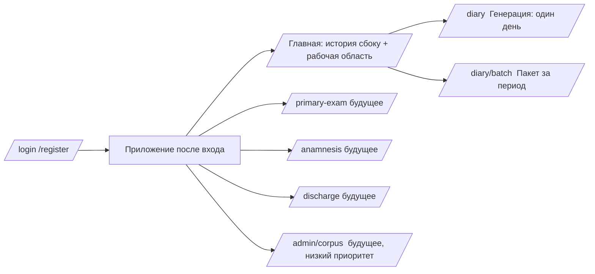
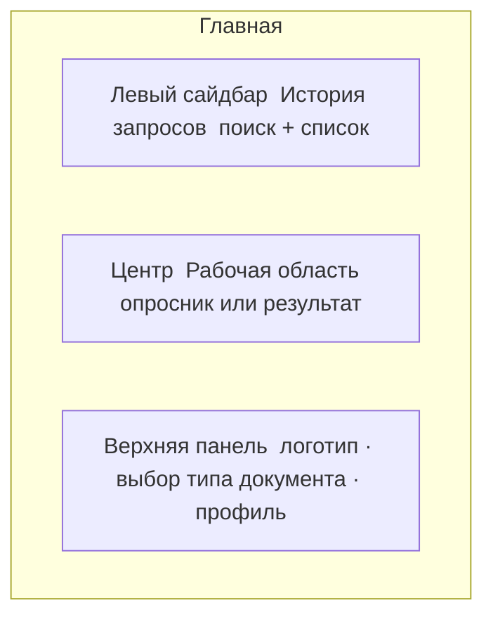
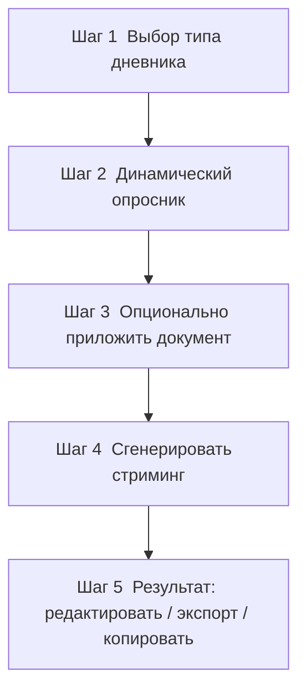
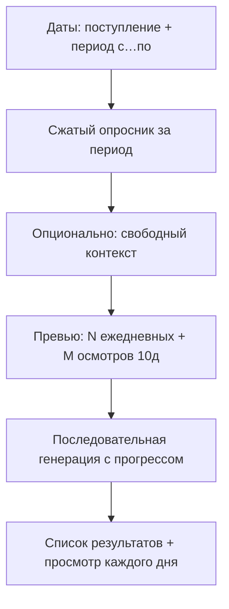

# 08. UI/UX дизайн

> Описание страниц, роутов, компонентов и дизайн-языка. Визуальный язык — тёмная тема в стиле **cursor.com**: дорогой минимализм, много «воздуха», сдержанные акценты, отличная типографика.

---

## 1. Дизайн-принципы

1. **Минимализм и фокус.** На экране только то, что нужно для текущего шага. Никакого визуального шума.
2. **Тёмная тема как основная** (как у Cursor): глубокий тёмный фон, мягкие контрасты, один акцентный цвет.
3. **«Летает».** React 19 + Vite, мгновенные реакции, оптимистичный UI, скелетоны вместо спиннеров.
4. **Клавиатура-френдли.** Врач должен проходить опросник почти не отрывая рук от клавиатуры (Tab, стрелки, Enter).
5. **Доверие и спокойствие.** Это медицинский инструмент — интерфейс серьёзный, аккуратный, без «игривости».

---

## 2. Дизайн-язык в стиле Cursor

### 2.1. Палитра (тёмная тема)
| Роль | Цвет (ориентир) | Применение |
|---|---|---|
| Фон базовый | `#0A0A0A` / `#0D0D0F` | основной фон приложения |
| Фон поверхности | `#141416` / `#17171A` | карточки, панели, сайдбар |
| Граница | `#26262A` | тонкие разделители, бордеры инпутов |
| Текст основной | `#EDEDED` | заголовки, основной текст |
| Текст вторичный | `#A1A1AA` | подписи, метаданные |
| Акцент | сдержанный (напр. `#7C9CFF` / мягкий бело-голубой) | кнопки действия, фокус, активные состояния |
| Успех / ошибка | приглушённые зелёный/красный | статусы, PII-блокировка |

> Принцип Cursor: **акцент используется скупо** — большая часть интерфейса нейтрально-тёмная, акцентом выделяется только главное действие.

### 2.2. Типографика
- Шрифт интерфейса: гротеск (Inter / Geist / системный SF-подобный).
- Моноширинный (JetBrains Mono / Geist Mono) — для сгенерированного текста дневника (создаёт ощущение «документа/кода»).
- Чёткая иерархия: крупные тонкие заголовки, спокойный body, мелкие caption’ы вторичным цветом.

### 2.3. Пространство и форма
- Щедрые отступы (8-pt grid), много «воздуха».
- Скруглённые углы (8–12px), очень тонкие бордеры, мягкие тени почти отсутствуют (флэт + контур).
- Тонкие разделители вместо тяжёлых блоков.

### 2.4. Микровзаимодействия
- Плавные переходы (150–200ms), подсветка фокуса акцентом.
- Скелетоны при загрузке истории/схемы.
- **Стриминг генерации**: текст дневника «печатается» по мере ответа LLM (через SSE).

---

## 3. Структура и роуты

| Роут | Назначение | Статус |
|---|---|---|
| `/login`, `/register` | вход/регистрация | MVP |
| `/` | главная: сайдбар истории + рабочая область | MVP |
| `/diary` | страница генерации дневников (один день) | **MVP (ядро)** |
| `/diary/batch` | пакетная генерация дневников за период | **MVP** |
| `/primary-exam`, `/anamnesis`, `/discharge` | другие типы документов | будущее (каждый — отдельный роут) |
| `/admin/corpus` | загрузка документов в корпус | будущее |

> Архитектурно каждый тип документа — **отдельная страница-роут**, что прямо соответствует требованию масштабирования.

---

## 4. Макет главной страницы

### 4.1. Левый сайдбар — История запросов
- Список прошлых запросов врача (обезличенные `title_safe`).
- Поиск/фильтр по типу документа и тексту заголовка.
- Клик → открыть запрос в рабочей области (просмотр/переиспользование).
- Кнопка «＋ Новый дневник» вверху.
- В стиле Cursor: узкий, тёмный, со вторичным текстом и тонкими разделителями.

### 4.2. Центр — Рабочая область
Два состояния:
- **Состояние «Опросник»**: пошаговая/сгруппированная форма вопросов (см. §5).
- **Состояние «Результат»**: сгенерированный дневник + панель действий (копировать, Word, PDF, редактировать).

### 4.3. Верхняя панель
- Профиль врача, выход.

На страницах `/diary` и `/diary/batch` — **переключатель режима** («Один день» / «Пакет за период»). На `/diary` дополнительно — переключатель типа документа («Ежедневный» / «Осмотр 10 дней»).

---

## 5. Страница `/diary` — поток генерации

### 5.1. Опросник (ключевой экран)
- Вопросы сгруппированы логически (Состояние · Поведение · Сон/Аппетит · Терапия · События).
- **Дропдауны** с понятными лейблами; **условные вопросы** плавно появляются под родителем.
- В каждом дропдауне внизу — пункт **«➕ Свой вариант»** → раскрывает инпут.
- Дефолтные значения уже выбраны (быстрый проход «всё в норме»).
- Прогресс/счётчик отвечено N из M.
- Кнопка «Сгенерировать» становится активной, когда заполнены обязательные.

### 5.2. Приложение документа
- Drag-and-drop зона.
- После загрузки — бейдж «Анонимизировано ✓ (удалено N сущностей)»; если гейт заблокировал — явная ошибка приватности.

### 5.3. Результат
- Текст в моношрифте, на «карточке-документе».
- Плейсхолдеры `[ДАТА]`, `[ФИО_ВРАЧА]` визуально подсвечены; перед экспортом — модалка подстановки реальных значений (локально).
- Панель действий: **Копировать** · **Скачать Word** · **Скачать PDF** · **Редактировать**.
- Возможность отредактировать текст прямо в поле перед экспортом.

---

## 5a. Страница `/diary/batch` — пакетная генерация

Поток для врача, которому нужно закрыть дневники за несколько дней одним проходом.

### Поля

| Поле | Обязательность | Назначение |
|---|---|---|
| **Дата поступления** | обязательно | Отсчёт дней госпитализации; правило 10/20/30… |
| **Период (с — по)** | обязательно | Календарный диапазон генерации (макс. 31 день) |
| **Сжатый опросник** | обязательные пункты | Динамика, настроение, поведение, сон, аппетит, терапия, жалобы |
| **Динамика веса/кормления** | необязательно | Тренд питания за период |
| **Ключевые события** | необязательно | Консультации, эпизоды |
| **Синдром / динамика эпикриза** | необязательно | Для дней осмотра 10 дней (дефолты заданы) |
| **Свободный контекст** | необязательно | Общий текст, добавляется к каждому дневнику |

### Правило «10 дней»

- **День 1** = дата поступления.
- **Дни 10, 20, 30…** от поступления автоматически генерируются как `exam_10d` (расширенный осмотр).
- Остальные дни — `daily` (ежедневный дневник).
- API: последовательные вызовы `POST /api/v1/generate` (без отдельного batch-эндпоинта генерации); каждый результат сохраняется в истории.
- **Экспорт пакета:** кнопки «Экспорт в Word» / «Экспорт в PDF» на экране результата → `POST /api/v1/export/batch` (все успешные дни в один файл, по дате).

### UX

- Превью перед запуском: «N ежедневных, M осмотров».
- Прогресс: список дней со статусами (ожидание / … / ✓ / ✗).
- По завершении — боковой список дней + просмотр текста; кнопки **«Экспорт в Word»** / **«Экспорт в PDF»** скачивают все успешные дни одним файлом; записи доступны в истории (экспорт по одному — как на `/diary`).

---

## 6. Компоненты (React 19)

| Компонент | Назначение |
|---|---|
| `AppShell` | layout: топбар + сайдбар + контент |
| `HistorySidebar` | список/поиск истории |
| `DocumentTypeSwitcher` | выбор типа документа (один день) |
| `DiaryNav` | переключатель «Один день» / «Пакет за период» |
| `BatchDiaryPage` | пакетная генерация за период |
| `QuestionnaireRenderer` | рендер JSON-схемы опросника |
| `QuestionField` | один вопрос (select/multiselect/text/number/custom) |
| `ConditionalGroup` | управление показом условных вопросов |
| `AttachmentDropzone` | загрузка + статус анонимизации |
| `GenerationView` | стриминговый вывод результата |
| `ResultActions` | копировать/экспорт/редактировать |
| `SubstitutionModal` | локальная подстановка ПДн перед экспортом |
| `AuthForms` | вход/регистрация |

**React 19 фичи к использованию:** Actions/`useActionState` для форм, `useOptimistic` для мгновенного отклика истории, `use()` для асинхронных данных + Suspense-скелетоны, Server-friendly паттерны (если будет SSR — опционально).

---

## 7. Состояния и обратная связь

| Состояние | UI |
|---|---|
| Загрузка схемы/истории | скелетоны |
| Генерация идёт | стриминг текста + индикатор модели («x5-airun-large») |
| PII заблокирован (422) | заметный, но спокойный баннер: «Обнаружены персональные данные — запрос не выполнен» |
| LLM недоступен (fallback исчерпан) | «Сервис генерации временно недоступен, попробуйте позже» |
| Успех экспорта | тост «Файл сохранён» |
| Пустая история | дружелюбный empty-state с кнопкой «Создать первый дневник» |

---

## 8. Доступность и язык
- Весь UI — на русском.
- Контраст текста соответствует WCAG AA на тёмном фоне.
- Полная клавиатурная навигация; видимый фокус (акцентный контур).

---

Дальше: безопасность и приватность — [`09_security_privacy.md`](09_security_privacy.md).
