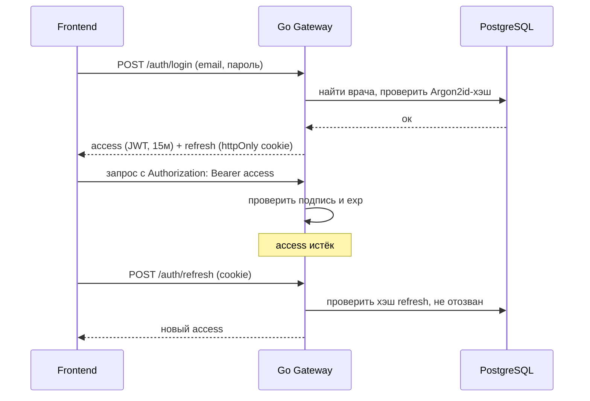
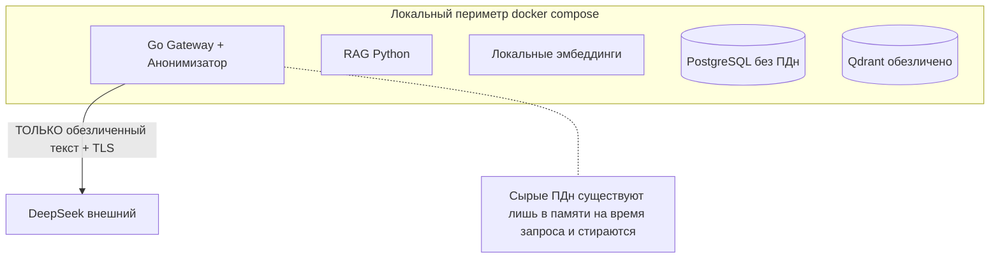

# 09. Безопасность и приватность

> Аутентификация, хранение паролей, изоляция данных по врачу, threat model и гарантия «ничего не утекает с компьютера».

---

## 1. Модель аутентификации

### 1.1. Требования
- У каждого врача — **свой аккаунт** с регистрацией.
- Без 2FA на MVP.
- Каждый врач видит **только свою** историю запросов.

### 1.2. ⭐ Решение и обоснование: своя реализация на Go (JWT + Argon2id)

**Сравнение вариантов:**

| Вариант | Плюсы | Минусы | Вердикт |
|---|---|---|---|
| **Своя реализация на Go (JWT + Argon2id)** | Полный контроль; **демонстрирует навыки Go** (важно для диплома); минимум зависимостей; легко в Docker; ровно столько функций, сколько нужно | Нужно аккуратно реализовать (но паттерн стандартный) | ✅ **Выбор для MVP** |
| Keycloak / Authentik (готовое OSS) | Промышленный IdP, OAuth2/OIDC, из коробки | Тяжёлый контейнер, избыточен для 2 ролей, съедает время недели, «прячет» Go-логику | не для MVP |
| Auth-as-a-service (облако) | быстро | ❌ внешняя зависимость, противоречит приватности | нет |

**Почему своя реализация — «золотой стандарт» именно здесь:**
1. Диплом по Go → аутентификация на Go = ещё один честный, защищаемый Go-компонент в составе Gateway.
2. Требования простые (2 роли, без 2FA) — промышленный IdP избыточен.
3. Argon2id — **текущий рекомендованный** алгоритм хэширования паролей (победитель Password Hashing Competition, рекомендация OWASP).
4. Всё локально, без внешних зависимостей — соответствует приватности.

### 1.3. Схема токенов
- **Access-token (JWT):** короткоживущий (~15 мин), подписан секретом (HS256) или ключом (RS256). Содержит `doctor_id`, `role`, `exp`. Хранится в памяти фронта.
- **Refresh-token:** длинноживущий, **opaque** (случайная строка), хранится в **httpOnly cookie**; в БД — только его **хэш** (таблица `session`). Позволяет отзыв (logout/компрометация).
- Ротация refresh-токенов; отзыв через `session.revoked`.

---

## 2. Хранение паролей

- **Только Argon2id** (рекомендованные параметры: memory ~64MB, iterations ~3, parallelism ~1–2; калибровать под сервер).
- Уникальная соль на пароль (встроена в формат Argon2id).
- Никогда не храним и не логируем пароли в открытом виде.
- Политика паролей: минимальная длина, проверка на тривиальность (на MVP — базовая).

---

## 3. Изоляция данных по врачу

- Все запросы к истории/документам **обязательно** фильтруются по `doctor_id` из проверенного JWT — на уровне репозитория, не только UI.
- Прямой доступ по `request_id` проверяет владельца (иначе `403/404`).
- Запрещены любые «глобальные» выборки истории без владельца.

---

## 4. ⭐ Гарантия «ничего не утекает с компьютера»

Это центральное приватностное требование. Обеспечивается совокупностью мер:

| Мера | Как реализуется |
|---|---|
| **Гейт анонимизации до записи/отправки** | [`04_anonymization.md`](04_anonymization.md): ни байта ПДн в БД/Qdrant/лог/LLM. |
| **Локальные эмбеддинги и NER** | модель эмбеддингов и NER крутятся в контейнерах локально; корпус индексируется без выхода наружу. |
| **Во внешний LLM — только обезличенный текст** | финальный промпт уже без ПДн; плейсхолдеры вместо реальных значений. |
| **TLS-верификация** | включена всегда; `LLM_CA_BUNDLE` пуст по умолчанию и задаётся только для корпоративного прокси. |
| **Необратимая анонимизация** | карта «плейсхолдер→значение» на сервере не хранится; реальные значения подставляются на клиенте при экспорте. |
| **Логи без значений ПДн** | логируем только счётчики обезличенных сущностей. |
| **Эфемерность сырых данных** | сырой ввод живёт только в оперативной памяти Go на время обработки, не персистится. |

---

## 5. Threat Model (STRIDE-кратко)

| Угроза | Пример | Митигизация |
|---|---|---|
| **Spoofing** | подделка пользователя | JWT-подпись, проверка `exp`, refresh c отзывом |
| **Tampering** | подмена токена/запроса | подписанные JWT, HTTPS, валидация входа |
| **Repudiation** | отрицание действия | аудит-события (без ПДн): кто/когда генерировал (по `doctor_id`) |
| **Information Disclosure** | утечка ПДн пациента | **гейт анонимизации**, локальная обработка, логи без ПДн, изоляция по врачу |
| **Denial of Service** | перегрузка генерацией | rate-limit на `/generate`, тайм-ауты, очередь |
| **Elevation of Privilege** | врач лезет в чужие данные/в админку | проверка владельца, проверка роли `admin` |

---

## 6. Прочие меры безопасности

- **Секреты** (`LLM_API_KEY`, JWT-секрет, пароль БД) — в `.env`/секрет-хранилище, **не в коде/репозитории**; `.env.example` без значений (как в `hh_analyser`).
- **CORS** — белый список origin фронтенда.
- **Валидация входных данных** на Gateway (размер файла, типы, длины).
- **Rate limiting** на чувствительных эндпоинтах (`/auth/login`, `/generate`).
- **Заголовки безопасности** (CSP, HSTS при HTTPS, X-Content-Type-Options).
- **Минимальные контейнеры** (Go — статический бинарь, distroless/alpine), малая поверхность атаки.
- **Зависимости** — регулярная проверка уязвимостей (govulncheck для Go, pip-audit для Python).

---

## 7. Соответствие нормам (контекст диплома)
Продукт спроектирован в духе требований к защите персональных данных (минимизация, локальная обработка, обезличивание). На этапе диплома он **не является сертифицированным медизделием**; цель — продемонстрировать инженерно грамотный, приватный дизайн. Сертификация/152-ФЗ-комплаенс — за пределами MVP, но архитектура к этому готова (обезличивание by design).

---

Дальше: пошаговый план реализации — [`10_roadmap_stepbystep.md`](10_roadmap_stepbystep.md).
