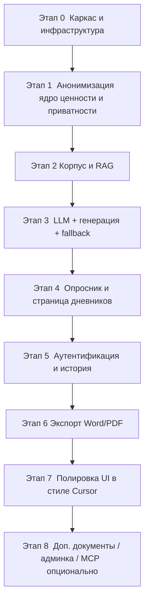

# 10. Пошаговый план реализации (Step-by-Step Roadmap)

> **Самый важный документ для заказчика.** Описывает, как продукт собирается по частям — от пустого репозитория до работающего MVP. Каждый шаг: что делаем, зачем, как проверить результат. Учтён срок ~1 неделя и приоритеты: **дневники — ядро; админка, доп. документы, MCP — в конце.**
>
> Здесь нет оценок в часах/днях — только порядок и проверяемость (как и просили). Отмечено, что хорошо ложится в текст диплома.

---

## 0. Логика порядка

Собираем систему «вертикальными срезами»: сначала — тонкий сквозной поток «вход → анонимизация → заглушка генерации → вывод», затем последовательно усиливаем каждый узел. Это гарантирует, что в любой момент есть **что показать**, и снижает риск «всё написали, ничего не работает вместе».

---

## Этап 0. Каркас и инфраструктура

**Что делаем:**
- Репозиторий, структура папок (`gateway/` Go, `rag/` Python, `frontend/` React, `docs/`, `deploy/`).
- `docker-compose.yml` со скелетами сервисов: `frontend`, `gateway`, `rag`, `postgres`, `qdrant` (+ `embeddings`).
- `.env.example` (по образцу `hh_analyser`: `API_KEY`, `LLM_BASE_URL`, `LLM_CA_BUNDLE`, список моделей, JWT-секрет, DSN Postgres).
- Health-эндпоинты во всех сервисах.

**Зачем:** единая среда «одной командой», на которую дальше наслаиваем функции.

**Проверка:** `docker compose up` поднимает все контейнеры; `GET /api/v1/health` отвечает; Qdrant и Postgres доступны.

**Для диплома:** раздел «Инфраструктура и развёртывание», диаграмма compose-топологии.

---

## Этап 1. ⭐ Анонимизация (ядро приватности и ценности)

> Делаем первым, потому что это **самый критичный и самый защищаемый** компонент, и от него зависит всё остальное (ingestion корпуса тоже через него).

**Что делаем (Go-сервис, см. [`04_anonymization.md`](04_anonymization.md)):**
- Уровни 1–3 (нормализация, regex-детекторы дат/адресов/номеров, словари медперсонала/учреждений).
- Уровни 4–5 (NER + морфология ФИО) — локальный Python-сайдкар или Go-порт.
- Уровень 6 (whitelist: МКБ, препараты) и Уровень 7 (валидатор-гейт).
- Типизированные плейсхолдеры.
- Юнит-тесты + recall/precision-набор + гейт в CI.

**Зачем:** гарантировать, что ПДн не утекут; обеспечить безопасный ingestion корпуса.

**Проверка:** на синтетических текстах с подсаженными ПДн recall близок к 100%; МКБ/препараты не удаляются; гейт блокирует остаточные ПДн.

**Для диплома:** сильнейший раздел — «Многоуровневый пайплайн обезличивания русскоязычных медицинских данных», метрики качества, обоснование роли Go.

---

## Этап 2. Корпус и RAG

**Что делаем (Python RAG, см. [`03_rag_design.md`](03_rag_design.md)):**
- Извлечение текста из `.docx`/`.odt`.
- Структурный чанкинг (ежедневная запись / секции осмотра) + метаданные (`doc_type`, `section`, `syndrome`, `diagnosis_class`, `dynamics`).
- Локальная модель эмбеддингов (e5) в контейнере.
- Ingestion-скрипт: текст → **анонимизация (Этап 1)** → чанкинг → эмбеддинг → upsert в Qdrant.
- Retrieval с фильтрацией по метаданным.

**Зачем:** дать генерации «узнаваемый» стиль отделения на основе реального обезличенного корпуса.

**Проверка:** корпус проиндексирован (только обезличенные чанки); по тестовому запросу retrieval возвращает релевантные образцы нужного `doc_type`.

**Для диплома:** «RAG: эмбеддинги, векторный поиск, структурный чанкинг медтекстов», обоснование Qdrant и локальных эмбеддингов.

---

## Этап 3. ⭐ LLM, генерация и fallback

**Что делаем (Go-Gateway, паттерн из `hh_analyser`):**
- OpenAI-совместимый клиент: `base_url`, Bearer-ключ, **корпоративный CA-bundle**, тайм-ауты, ретраи.
- Абстрактный интерфейс LLM-клиента (заменяемость провайдера).
- Сборка промпта: шаблон + RAG-образцы + ответы опросника.
- **Fallback** large → medium → small (см. [`03_rag_design.md`](03_rag_design.md) §10).
- Пост-валидация результата гейтом (нет ПДн).
- (Желательно) стриминг (SSE).

**Зачем:** превратить ответы + контекст в готовый дневник, надёжно (с резервированием модели).

**Проверка:** `POST /generate` (с замоканными ответами) возвращает осмысленный дневник; при недоступности основной модели происходит переключение; `GET /models` подтверждает доступные модели токену.

**Для диплома:** «Интеграция корпоративного LLM, отказоустойчивость (fallback), безопасное TLS-подключение через корпоративный CA».

---

## Этап 4. Опросник и страница дневников

**Что делаем (Frontend + Gateway):**
- JSON-схемы опросника для `daily` и `exam_10d` (см. [`06_dynamic_questionnaire.md`](06_dynamic_questionnaire.md)).
- `GET /questionnaire` отдаёт схему; фронт рендерит вопросы, условную логику, дропдауны и «Свой вариант».
- Страница `/diary`: выбор типа → опросник → генерация → результат.
- Приложение документа: `POST /attachments` (анонимизация + ingestion нового).

**Зачем:** это **главный пользовательский сценарий** — ради него всё и делается.

**Проверка:** врач проходит опросник по обоим типам, получает готовый дневник; приложенный документ обезличивается и (если новый) дозагружается в Qdrant.

**Для диплома:** «Динамический опросник на основе анализа реального корпуса», дерево условных вопросов.

---

## Этап 5. Аутентификация и история

**Что делаем (Go, см. [`09_security_privacy.md`](09_security_privacy.md)):**
- Регистрация/вход, Argon2id-хэши, JWT (access) + refresh (httpOnly, хэш в БД).
- Изоляция истории по `doctor_id`.
- Эндпоинты `/auth/*`, `/requests`.
- Сайдбар истории на фронте (обезличенные `title_safe`).

**Зачем:** приватные аккаунты, у каждого врача — только своя история.

**Проверка:** два врача не видят историю друг друга; access истекает и обновляется по refresh; logout отзывает refresh.

**Для диплома:** «Безопасная аутентификация на Go (JWT + Argon2id), изоляция данных, threat model».

---

## Этап 6. Экспорт Word/PDF

**Что делаем (Go-сервис экспорта):**
- Генерация `.docx` и `.pdf` из текста дневника.
- Модалка локальной подстановки реальных значений в плейсхолдеры (`[ДАТА]`, `[ФИО_ВРАЧА]`) **на клиенте** перед экспортом; реальные ПДн на сервере не сохраняются.
- Кнопки «Копировать / Word / PDF».

**Зачем:** довести результат до пригодного к подшивке документа.

**Проверка:** скачанные Word/PDF корректно открываются, форматирование сохранено, плейсхолдеры заменены на введённые значения.

**Для диплома:** «Потоковая генерация документов на Go».

---

## Этап 7. Полировка UI в стиле Cursor

**Что делаем:** тёмная тема, типографика, отступы, акценты, скелетоны, стриминг-«печать», микроанимации, empty-states, баннер PII-блокировки (см. [`08_ui_ux.md`](08_ui_ux.md)).

**Зачем:** «дорогой минимализм», который «летает» — впечатление на защите и удобство врача.

**Проверка:** интерфейс отзывчивый, аккуратный, клавиатура-френдли, выглядит в духе cursor.com.

**Для диплома:** «UI/UX: дизайн-система, тёмная тема, React 19».

---

## Этап 8. Опционально (низкий приоритет, если останется время)

В порядке убывания приоритета:
1. **Доп. типы документов** — добавить роут + JSON-схему + промпт-шаблон для одного из: первичный осмотр / анамнез / выписной эпикриз (демонстрирует масштабируемость без переписывания ядра).
2. **Админка корпуса** — UI `POST /admin/corpus` для загрузки новых документов (анонимизация + ingestion) под ролью `admin`.
3. **Клинические рекомендации** — отдельная коллекция Qdrant, точечно для эпикриза/первички (на дневники не подключаем).
4. **MCP-фасад** — обернуть Go-сервис анонимизации в MCP-инструмент `anonymize_text` (см. [`02_system_architecture.md`](02_system_architecture.md) §6). «Вишенка» для преподавателя, без риска для ядра.

**Для диплома:** «Масштабируемость архитектуры и перспективы развития» + (опц.) «MCP как способ публикации инструментов».

---

## Карта «этап → главные документы»

| Этап | Опорные документы |
|---|---|
| 0 | [`02_system_architecture.md`](02_system_architecture.md) |
| 1 | [`04_anonymization.md`](04_anonymization.md) |
| 2 | [`03_rag_design.md`](03_rag_design.md), [`05_data_model.md`](05_data_model.md) |
| 3 | [`03_rag_design.md`](03_rag_design.md) (LLM/fallback) |
| 4 | [`06_dynamic_questionnaire.md`](06_dynamic_questionnaire.md), [`07_api_contract.md`](07_api_contract.md) |
| 5 | [`09_security_privacy.md`](09_security_privacy.md), [`05_data_model.md`](05_data_model.md) |
| 6 | [`07_api_contract.md`](07_api_contract.md) (export) |
| 7 | [`08_ui_ux.md`](08_ui_ux.md) |
| 8 | [`02_system_architecture.md`](02_system_architecture.md) §6 |

---

## Минимально жизнеспособная «демо-цепочка» (если время совсем поджимает)

Если неделя «горит», абсолютный минимум для защиты — сквозной поток:
**Вход опросника → анонимизация-гейт → RAG (хотя бы на pgvector как План Б) → генерация с fallback → результат на экране → экспорт в Word.** 
Аутентификация может быть упрощена (один аккаунт), полировка UI — минимальной. Это уже демонстрирует все ключевые тезисы диплома, включая роль Go в приватности и оркестрации.

---

Назад к оглавлению — [`README.md`](README.md).
